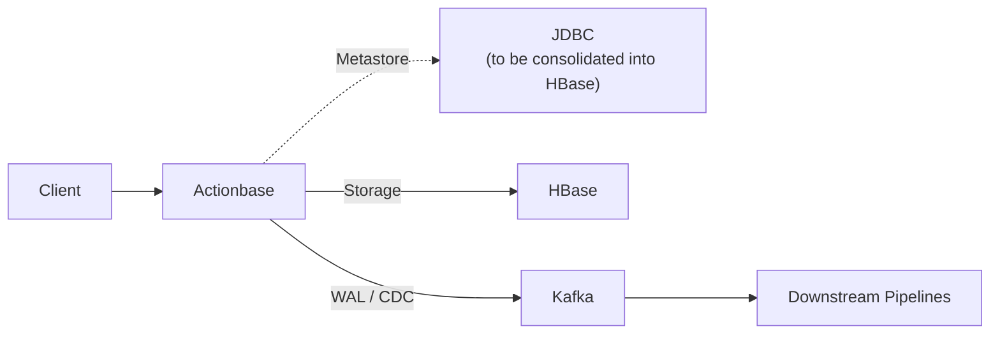

# Actionbase

> 🚀 **Open-sourced** — [Learn more](https://actionbase.io/blog/open-source-announcement/)

Likes, recent views, follows—look simple, but get complex as you scale, and end up rebuilt again and again.

Actionbase is a database for serving these user interactions at scale. Currently backed by HBase, built at Kakao, handling millions of requests per minute at peak for years.

## Quick Start

```bash
docker run -it --pull always ghcr.io/kakao/actionbase:standalone
```
```
actionbase> load preset likes
Database 'likes' is created
Table 'likes' is created
/* Insert edge Alice → Phone */
1 edges of 'likes' are mutated (total: 1, failed: 0)
/* Insert edge Alice → Laptop */
1 edges of 'likes' are mutated (total: 1, failed: 0)
/* Insert edge Bob → Phone */
1 edges of 'likes' are mutated (total: 1, failed: 0)
(Took 0.5992 seconds)

actionbase> use database likes
[2026-01-20 20:38:32][DEBUG] GET /graph/v2/service/likes
[2026-01-20 20:38:32][DEBUG] 200 OK
 {"active":true,"name":"likes","desc":""}
The database is changed to 'likes'
(Took 0.0139 seconds)

actionbase(likes)> use table likes
[2026-01-20 20:38:39][DEBUG] GET /graph/v2/service/likes/label/likes
[2026-01-20 20:38:39][DEBUG] 200 OK
 {"active":true,"name":"likes.likes","desc":"Like","type":"INDEXED","schema":{"src":{"type":"STRING","desc":"userId"},"tgt":{"type":"STRING","desc":"targetId"},"fields":[{"name":"created_at","type":"LONG","nullable":false,"desc":"created_at"}]},"dirType":"BOTH","storage":"datastore://likes/likes","groups":[],"indices":[{"name":"created_at_desc","fields":[{"name":"created_at","order":"DESC"}],"desc":"order by created_at"}],"event":false,"readOnly":false,"mode":"SYNC"}
The table is changed to 'likes:likes'
(Took 0.0182 seconds)

actionbase(likes:likes)> get --source Alice --target Phone
[2026-01-20 20:46:17][DEBUG] GET /graph/v3/databases/likes/tables/likes/edges/get?source=Alice&target=Phone
[2026-01-20 20:46:17][DEBUG] 200 OK
 {"edges":[{"version":1768909550245,"source":"Alice","target":"Phone","properties":{"created_at":1768909550245},"context":{}}],"count":1,"total":1,"offset":null,"hasNext":false,"context":{}}

The edge is found: [Alice -> Phone]
|---------------|--------|--------|---------------------------|
| VERSION       | SOURCE | TARGET | PROPERTIES                |
|---------------|--------|--------|---------------------------|
| 1768909550245 | Alice  | Phone  | created_at: 1768909550245 |
|---------------|--------|--------|---------------------------|
(Took 0.0717 seconds)

actionbase(likes:likes)> scan --index created_at_desc --start Alice --direction OUT
[2026-01-20 20:46:25][DEBUG] GET /graph/v3/databases/likes/tables/likes/edges/scan/created_at_desc?direction=OUT&limit=25&start=Alice
[2026-01-20 20:46:25][DEBUG] 200 OK
 {"edges":[{"version":1768909550297,"source":"Alice","target":"Laptop","properties":{"created_at":1768909550297},"context":{}},{"version":1768909550245,"source":"Alice","target":"Phone","properties":{"created_at":1768909550245},"context":{}}],"count":2,"total":-1,"offset":null,"hasNext":false,"context":{}}
The 2 edges found (offset: -, hasNext: false)
|---|---------------|--------|--------|---------------------------|
| # | VERSION       | SOURCE | TARGET | PROPERTIES                |
|---|---------------|--------|--------|---------------------------|
| 1 | 1768909550297 | Alice  | Laptop | created_at: 1768909550297 |
| 2 | 1768909550245 | Alice  | Phone  | created_at: 1768909550245 |
|---|---------------|--------|--------|---------------------------|
(Took 0.0270 seconds)

actionbase(likes:likes)> count --start Alice --direction OUT
[2026-01-20 20:46:40][DEBUG] GET /graph/v3/databases/likes/tables/likes/edges/counts?start=Alice&direction=OUT
[2026-01-20 20:46:40][DEBUG] 200 OK
 {"counts":[{"start":"Alice","direction":"OUT","count":2,"context":{}}],"count":1,"context":{}}

The count of 1 edges found
|---|-------|-----------|-------|
| # | START | DIRECTION | COUNT |
|---|-------|-----------|-------|
| 1 | Alice | OUT       | 2     |
|---|-------|-----------|-------|
(Took 0.0306 seconds)
```

See [Quick Start](https://actionbase.io/quick-start/) for more details, or [Build Your Social Media App with Actionbase](https://actionbase.io/guides/build-your-social-media-app/) to go deeper.

## How It Works

Actionbase serves interaction-derived data that powers feeds, product listings, recommendations, and other user-facing surfaces.

Interactions are modeled as: **who** did **what** to which **target**

At write time, Actionbase precomputes everything needed for reads—accurate counts, consistent toggles, and ordering information for sorting and querying. At read time, there's no aggregation or additional computation. You simply read the precomputed results as they are.

Supported operations focus on high-frequency access patterns:

* Edge lookups (GET, multi-get)
* Edge counts (COUNT)
* Indexed edge scans (SCAN)

## When (Not) to Use It

Use Actionbase when:
- A single database no longer scales for your workload
- Interaction features are rebuilt repeatedly across teams
- You need predictable read latency without read-time computation

If a single database can handle your workload, that's the better choice.

## Architecture

Actionbase writes to HBase for storage and emits a WAL to Kafka for recovery, replay, and downstream pipelines. HBase provides strong durability and horizontal scalability.



Additional storage backends are planned for small to mid-size deployments.

## Codebase Overview

* **core** — Data model, mutation, query, encoding logic (Java, Kotlin)
* **engine** — Storage and messaging bindings (Kotlin)
* **server** — REST API server (Kotlin, Spring WebFlux)
* **pipeline** *(planned)* — Bulk loading and CDC processing (Scala, Spark)

## Current Status

Early open-source preparation phase. The first release focuses on introducing core concepts and hands-on guides. Production installation, operations guides, and additional components will be released over time.

## Contribute

We welcome contributions. See our [Contributing Guide](https://actionbase.io/community/contributing/).

For questions, ideas, or feedback, join us on [GitHub Discussions](https://github.com/kakao/actionbase/discussions/).

## Learn More

* [Documentation](https://actionbase.io/)
* [Actionbase at if(kakaoAI) 2024](https://www.youtube.com/watch?v=8-hVAFVHISE) (YouTube, Korean)

## License

This software is licensed under the [Apache 2 license](LICENSE).

Copyright 2026 Kakao Corp. <http://www.kakaocorp.com>

Licensed under the Apache License, Version 2.0 (the "License"); you may not
use this project except in compliance with the License. You may obtain a copy
of the License at http://www.apache.org/licenses/LICENSE-2.0.

Unless required by applicable law or agreed to in writing, software
distributed under the License is distributed on an "AS IS" BASIS, WITHOUT
WARRANTIES OR CONDITIONS OF ANY KIND, either express or implied. See the
License for the specific language governing permissions and limitations under
the License.
