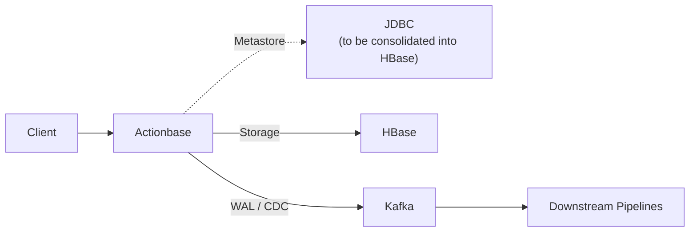

# Actionbase

> 🚀 **Open-sourced** — [Learn more](https://actionbase.io/blog/open-source-announcement/)

Likes, recent views, follows—look simple, but get complex as you scale, and end up rebuilt again and again.

Actionbase is a database for serving these user interactions at scale. Currently backed by HBase, built at Kakao, handling millions of requests per minute at peak for years.

## Demo

> ⚠️ **WIP**: Demo GIF (#28), Docker one-liner (#53)


Try it yourself:
```bash
docker run ...
```

Want to go deeper? See [Build Your Social Media App](https://actionbase.io/guides/build-your-social-media-app/).

## How It Works

Actionbase serves interaction-derived data that powers feeds, product listings, recommendations, and other user-facing surfaces.

Interactions are modeled as: _**who** did **what** to which **target**_

At write time, Actionbase precomputes everything needed for reads—accurate counts, consistent toggles, and ordering information for sorting and querying. At read time, there's no aggregation or additional computation. You simply read the precomputed results as they are.

Supported operations focus on high-frequency access patterns:

* Edge lookups (GET, multi-get)
* Edge counts (COUNT)
* Indexed edge scans (SCAN)

## When (Not) to Use It

Use Actionbase when:
- Interaction features are rebuilt repeatedly across teams
- A single database no longer scales for your workload
- You need predictable read latency without read-time computation

If a single, well-tuned database can handle your workload, that's the better choice.

## Architecture

Actionbase writes to HBase for storage and emits a WAL to Kafka for recovery, replay, and downstream pipelines. HBase provides strong durability and horizontal scalability.



Additional storage backends are planned for small to mid-size deployments.

## Codebase Overview

* **core** — Data model, mutation, query, encoding logic (Java, Kotlin)
* **engine** — Storage and messaging bindings (Kotlin)
* **server** — REST API server (Kotlin, Spring WebFlux)
* **pipeline** *(planned)* — Bulk loading and CDC processing (Scala, Spark)

## Current Status

Early open-source preparation phase. The first release focuses on introducing core concepts and hands-on guides. Production installation, operations guides, and additional components will be released over time.

## Contribute

We welcome contributions. See our [Contributing Guide](https://actionbase.io/community/contributing/).

For questions, ideas, or feedback, join us on [GitHub Discussions](https://github.com/kakao/actionbase/discussions/).

## Learn More

* [Documentation](https://actionbase.io/)
* [Introduction to Actionbase (Korean) / if(kakaoAI) 2024](https://www.youtube.com/watch?v=8-hVAFVHISE)

## License

This software is licensed under the [Apache 2 license](LICENSE).

Copyright 2026 Kakao Corp. <http://www.kakaocorp.com>

Licensed under the Apache License, Version 2.0 (the "License"); you may not
use this project except in compliance with the License. You may obtain a copy
of the License at http://www.apache.org/licenses/LICENSE-2.0.

Unless required by applicable law or agreed to in writing, software
distributed under the License is distributed on an "AS IS" BASIS, WITHOUT
WARRANTIES OR CONDITIONS OF ANY KIND, either express or implied. See the
License for the specific language governing permissions and limitations under
the License.
