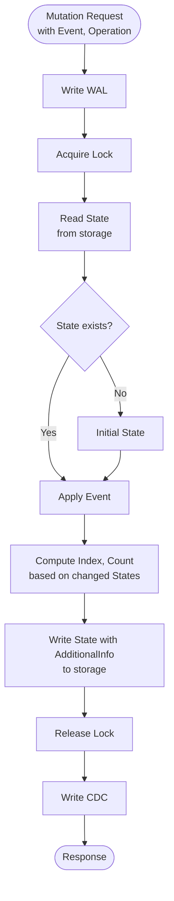
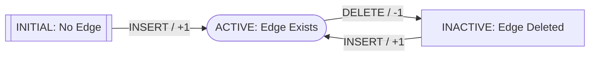

Mutations insert, update, and delete edges. The process ensures consistency, durability, and write-time optimization.

See [Core Concepts](/design/concepts/) for background.

## Mutation Flow

## Mutation Request

A mutation request contains:

- **Event**: The data change (e.g., new property values, edge creation)
- **Operation**: Insert, Update, or Delete

## Mutation Process

### 1. Write WAL

Mutation is written to WAL before changes are made. Enables recovery and replay.

In production, Kafka is used as WAL backend.

### 2. Acquire Lock

Prevents concurrent modifications:

- **Unique edges**: Lock on (source, target)
- **Multi edges**: Lock on edge ID

### 3. Read State

Read current state from storage—properties, timestamps, metadata.

### 4. Apply Event

Transition state based on operation and timestamp. See [State Transitions](#state-transitions) for details.

### 5. Compute Indexes and Counters

Based on changed state:

- **Indexes**: Delete old, create new
- **Counters**: Increment or decrement

### 6. Write to Storage

State, indexes, and counters written atomically.

### 7. Release Lock

Lock released after write.

### 8. Write CDC

Mutation recorded in CDC (Kafka in production). Resulting state available for downstream systems.

## State Transitions

Edges transition between states based on operations (INSERT, DELETE). Each event carries a timestamp, and Actionbase uses these timestamps to compute the correct final state—even for toggle scenarios (like/unlike/like) and out-of-order arrivals.

See [`State.transit`](https://github.com/kakao/actionbase/blob/main/core/src/main/kotlin/com/kakao/actionbase/core/state/StateExtensions.kt) for implementation.

### Diagram

Full state transition diagram

[Edit on PlantUML](https://www.plantuml.com/plantuml/uml/VPAnRiCW48PtdkAaRbLHcvKXYXKOaAoeIjmkYGTgKpKgmPKDxUlNLiw94JQJBOxlkn-uJUTKw_p5aFx7QP0xMSWi1mQgSkTVpS2UnrgsBUIxc9HSw_MDYwgVodIQaEDZ2PIk9-R3q9AGSO4U7pwCroLTtpiqFwm73c9VdAogAWQhanqQ-Ox1TY-oGl2HHtc0lhtoVWkYBtTKybnC-xQwBcEQYrp4zBZE2S7TwU0HZwbuWAlg6_bq-fZ7_4zrurpY6F0CLlz1qmuVZbAw2ayrOrNTrzKwxsnC3GltI-Gkl22Ck71FGK2PUkxGEec8fT1x3Rau0_4Zf8Se8KXDqG9EDjhM_cB-0G00)

### Example: Out-of-Order Events

Alice's actions: like(t=100) → unlike(t=200) → like(t=300)

Events arrive out of order: like(t=100) → like(t=300) → unlike(t=200)

| #   | Event Arrives  | State            | Count Change | Total |
| --- | -------------- | ---------------- | ------------ | ----- |
| 1   | like (t=100)   | INITIAL → ACTIVE | +1           | 1     |
| 2   | like (t=300)   | ACTIVE → ACTIVE  | 0            | 1     |
| 3   | unlike (t=200) | ACTIVE → ACTIVE  | 0            | 1     |

Final state: **ACTIVE**, count: **1** — same result regardless of arrival order.

## Write-Time Optimization

During mutations, Actionbase pre-computes:

| Structure   | Purpose            | Query Type |
| ----------- | ------------------ | ---------- |
| EdgeState   | Current edge state | GET        |
| EdgeIndex   | Sorted entries     | SCAN       |
| EdgeCounter | Aggregated counts  | COUNT      |

Reads use simple GET, COUNT, SCAN without query-time computation.

## Consistency Guarantees

| Mechanism         | Guarantee                                 |
| ----------------- | ----------------------------------------- |
| Locking           | Prevents concurrent modifications         |
| Atomic Writes     | State and indexes written together        |
| WAL               | Durability and recovery                   |
| Read-Modify-Write | Mutations based on latest state           |
| State Transitions | Correct final state despite event arrival |

## Next Steps

- [Query](/design/query/): Read pre-computed data
- [Mutation API](/api-references/mutation/): API reference
