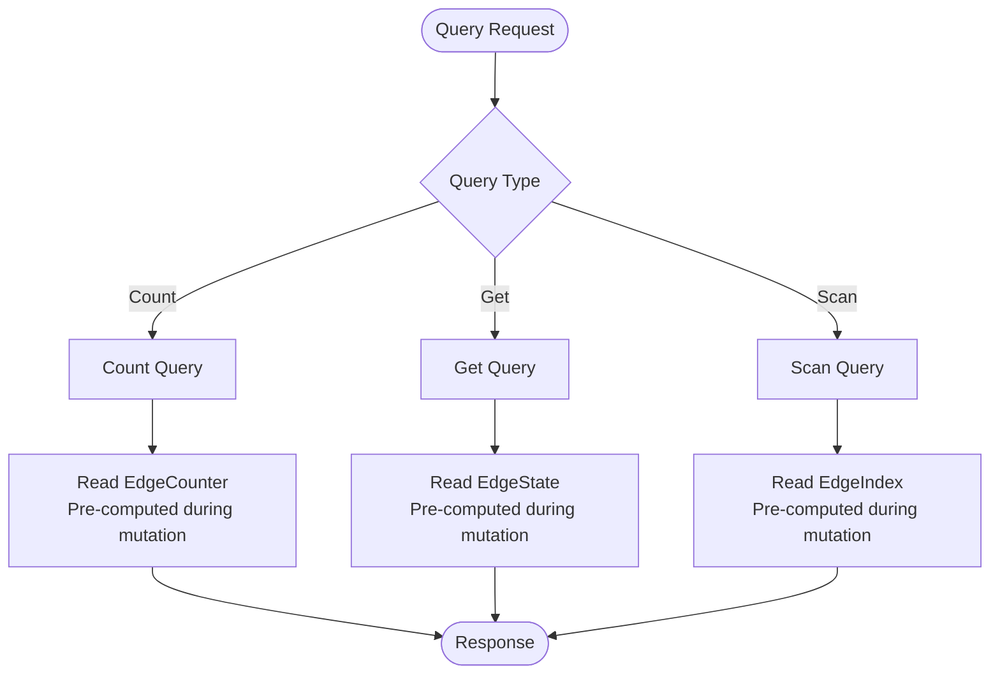

Queries in Actionbase retrieve data that was pre-computed during mutations. The query system accesses these structures directly, providing ultra-fast reads with consistent low latency.

For the conceptual foundation, see [Core Concepts](/design/concepts/).

## Query Philosophy

Actionbase queries read optimized data structures created during mutations:

| Structure | Created During | Accessed By |
|-----------|----------------|-------------|
| EdgeState | Mutation | Get Query |
| EdgeIndex | Mutation | Scan Query |
| EdgeCounter | Mutation | Count Query |

You explicitly choose the query type and specify the index to use, ensuring each query follows an optimized path prepared during write time.

## Query Types

### Count Query

Returns the number of edges matching a source node.

**Use case**: "How many products has this user viewed?"

**Processing**:
1. Construct EdgeCounter key from source, table, and direction
2. Return pre-computed counter value

**Example**: Answered instantly with a single get operation.

### Get Query

Retrieves edge state by source and target node IDs.

**Use case**: "Has this user viewed this product?"

**Processing**:
1. Construct EdgeState key from source and target
2. Return edge state directly

**MGet Support**:
- Multiple source or target IDs → multi-get operation
- Maximum 25 edges per API request
- Patterns: 1 source with N targets, or M sources with 1 target

### Scan Query

Scans edges using a pre-computed index with range filtering and pagination.

**Use case**: "Recent products viewed by this user"

**Processing**:
1. Construct EdgeIndex key prefix from source, table, direction, and index
2. Apply range filters to determine scan boundaries
3. Scan pre-computed index entries
4. Apply optional filters to results
5. Apply pagination (limit, offset)
6. Return matching edges

**Index Requirement**:
- You must specify which index to use
- The index must be defined in the schema
- Index entries are created during mutations

## Query Flow



## Index Ranges

Scan queries can specify ranges to filter data efficiently at the storage level.

### Key Concepts

| Concept | Description |
|---------|-------------|
| Explicit Index | You must specify which index to use |
| Operators | `eq`, `gt`, `lt`, `between` determine scan boundaries |
| Index Order | Ranges applied in order of fields defined in index |
| Sort Direction | Operator meaning depends on ASC/DESC |

### Range vs Filter

| Type | Level | Uses Index | Performance |
|------|-------|------------|-------------|
| Range | Storage | Yes | Fast |
| Filter | Application | No | After retrieval |

**Ranges** work with the pre-computed index structure, filtering at the storage level.
**Filters** are applied after retrieval and can use any field.

## Pagination

Scan queries support pagination:

| Parameter | Description |
|-----------|-------------|
| offset | Encoded string indicating starting position |
| limit | Maximum results; 25 is recommended for production |
| hasNext | Boolean indicating more results available |

Pagination works with the sorted index structure for efficient large result sets.

## Query Direction

Queries support two directions:

| Direction | Description | Example |
|-----------|-------------|---------|
| OUT | Outgoing edges | Products a user liked |
| IN | Incoming edges | Users who liked a product |

Separate index entries and counters are maintained for each direction during mutations.

## Read Path

```
Client → Server → Engine → Storage → Response
```

1. **Client**: Sends query via REST API, specifying query type and parameters
2. **Server**: Validates the request
3. **Engine**: Constructs storage key and retrieves pre-computed data
4. **Storage**: Returns EdgeState, EdgeIndex, or EdgeCounter
5. **Response**: Formatted results to client

This simple path accesses pre-optimized data, ensuring consistent low-latency performance.

## Performance Characteristics

| Characteristic | Guarantee |
|----------------|-----------|
| No Query-time Computation | Queries retrieve pre-computed data |
| Explicit Access Patterns | You choose query type and index |
| Consistent Structure | Data structure matches what was created during mutation |
| Predictable Latency | Performance is consistent regardless of data size |

## Next Steps

- [Schema](/design/schema/): Define indexes for your queries
- [Mutation](/design/mutation/): How pre-computed structures are created
- [API Reference](/api-references/query/): Complete query API
