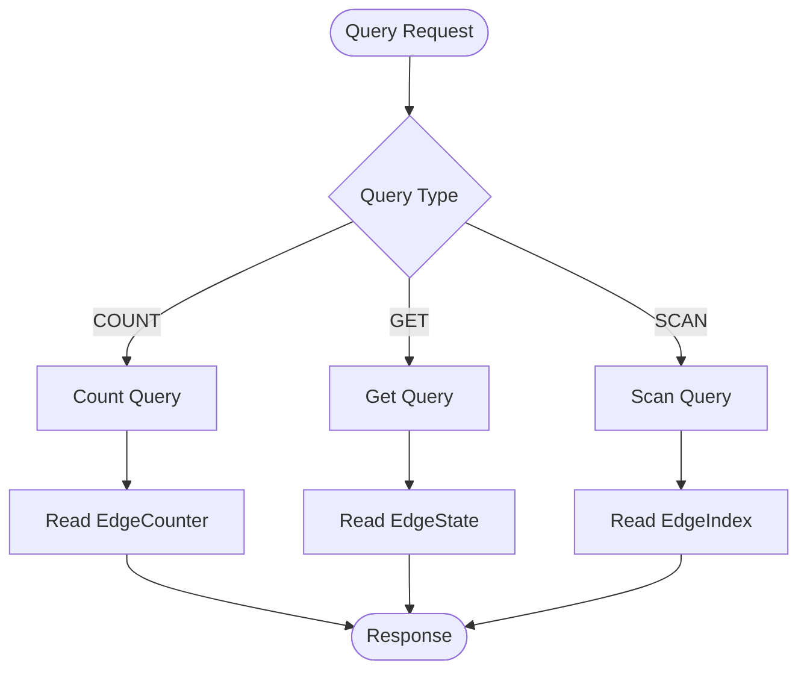

Queries retrieve data pre-computed during mutations.

See [Core Concepts](/design/concepts/) for background.

## Pre-computed Structures

| Structure   | Created During | Accessed By |
| ----------- | -------------- | ----------- |
| EdgeState   | Mutation       | GET         |
| EdgeIndex   | Mutation       | SCAN        |
| EdgeCounter | Mutation       | COUNT       |

You specify the query type and index. Each query accesses structures prepared at write time.

## Query Types

### COUNT

Returns the number of edges for a source node.

**Use case**: "How many products has this user viewed?"

**Processing**:

1. Construct EdgeCounter key from source, table, direction
2. Return pre-computed counter

### GET

Retrieves edge state by source and target.

**Use case**: "Has this user viewed this product?"

**Processing**:

1. Construct EdgeState key from source and target
2. Return edge state

**MGet**:

- Multiple source or target IDs → multi-get
- Max 25 edges per request
- Patterns: 1 source with N targets, or M sources with 1 target

### SCAN

Scans edges using a pre-computed index with range filtering and pagination.

**Use case**: "Recent products viewed by this user"

**Processing**:

1. Construct EdgeIndex key prefix from source, table, direction, index
2. Apply range filters
3. Scan index entries
4. Apply optional filters
5. Apply pagination (limit, offset)
6. Return matching edges

**Index Requirement**:

- Must specify which index to use
- Index must be defined in schema

## Query Flow



## Index Ranges

SCAN queries can specify ranges to filter at storage level.

| Concept        | Description                                     |
| -------------- | ----------------------------------------------- |
| Explicit Index | Must specify which index                        |
| Operators      | `eq`, `gt`, `lt`, `between` set scan boundaries |
| Index Order    | Ranges applied in field order                   |
| Sort Direction | Operator meaning depends on ASC/DESC            |

### Range vs Filter

| Type   | Level       | Uses Index | Performance     |
| ------ | ----------- | ---------- | --------------- |
| Range  | Storage     | Yes        | Fast            |
| Filter | Application | No         | After retrieval |

## Pagination

| Parameter | Description                  |
| --------- | ---------------------------- |
| offset    | Encoded starting position    |
| limit     | Max results (25 recommended) |
| hasNext   | More results available       |

## Query Direction

| Direction | Description    | Example                   |
| --------- | -------------- | ------------------------- |
| OUT       | Outgoing edges | Products a user liked     |
| IN        | Incoming edges | Users who liked a product |

Separate indexes and counters maintained for each direction.

## Read Path

```
Client → Server → Engine → Storage → Response
```

1. **Client**: Query via REST API
2. **Server**: Validate request
3. **Engine**: Construct key, retrieve data
4. **Storage**: Return EdgeState/EdgeIndex/EdgeCounter
5. **Response**: Return to client

## Next Steps

- [Schema](/design/schema/): Define indexes
- [Mutation](/design/mutation/): How structures are created
- [Query API](/api-references/query/): API reference
