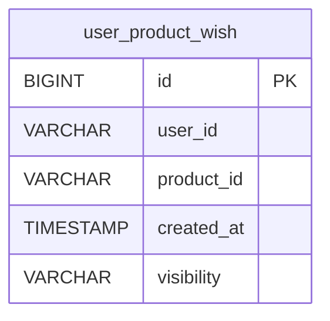
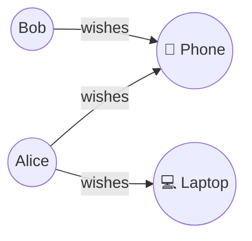

This document is for users familiar with relational databases (RDB)
who want to understand how Actionbase fits alongside an RDB-based system.

Actionbase is not a general-purpose database.
It focuses on relationship data—such as user–item or user–user connections—and models these relationships as interactions.

## Why Consider Actionbase with an RDB?

Relational databases are commonly used to manage transactional data.

As a service grows, tables that store large volumes of relationships or
interaction histories often present scaling challenges:

- Shard key management and hot entities
- High read and write throughput
- Cross-shard queries and rebalancing

Actionbase addresses these challenges by modeling relationships as interactions and leveraging horizontally scalable storage such as HBase.

For more details, see [Introduction](/introduction/).

## From Tables to Interactions

The difference lies in how relationships are represented and queried,
not in how entities are defined.

### Relationship Tables in an RDB

In an RDB, relationships are typically modeled using tables that:

- Connect two entity identifiers
- Store limited relationship metadata
- Exist mainly to support relationship-based queries

Examples include:

- User–user relationships (follows, blocks)
- User–item relationships (likes, recent views, wishes)
- User–content relationships (reactions, comments)

These tables are often accessed from one side of the relationship
and grow large over time.

### Interactions in Actionbase

In Actionbase:

- Entities are identified by source and target
- Relationships are modeled as interactions with schema-defined properties
- Read-optimized structures (indexes, counts) are pre-computed at write time

This design enables fast lookups such as:

- Listing items a user interacted with
- Counting interactions per user or per item
- Checking whether a specific interaction exists

RDB tables whose primary role is to represent relationships can often be mapped directly to interactions.

## When Actionbase Is a Good Fit

Actionbase is a good fit when:

- Interaction data dominates table volume
- Queries focus on listing or traversing relationships
- Scaling these tables in an RDB becomes operationally complex

Examples include:

- Social graphs (follows, blocks)
- User–item interactions (likes, recent views, wishes)
- User–content interactions (reactions, comments)

See [FAQ - What problems does Actionbase solve?](/faq/#what-problems-does-actionbase-solve) for more examples.

## Using Actionbase Together with an RDB

Actionbase is designed to complement an RDB, not replace it.

**Best practice**: If you are considering Actionbase, start by migrating only the large-scale user interaction tables that present scaling challenges—such as likes, follows, and recent views. Keep transactional and domain data in your RDB.

A common pattern is:

1. Transactional and domain data remains in the RDB
2. Large-scale user interaction data is stored in Actionbase
3. Interaction-centric queries are served from Actionbase

This separates transactional workloads from interaction-heavy access patterns.

## Example: Mapping an RDB Table to Actionbase

### RDB Table

```sql
CREATE TABLE user_product_wish (
    id BIGINT AUTO_INCREMENT PRIMARY KEY,
    user_id VARCHAR(255),
    product_id VARCHAR(255),
    created_at TIMESTAMP,
    visibility VARCHAR(50)
);
```



### Actionbase Table (Label)

In Actionbase, the same data is modeled as edges in a graph:



Each arrow represents an interaction (edge) with properties such as `created_at` and `visibility`.

This table maps to a Label with the following schema:

- **source**: user_id (STRING)
- **target**: product_id (STRING)
- **properties**:
  - created_at (LONG)
  - visibility (STRING)

The `id` column is not needed—Actionbase identifies edges by source and target.

Indexes can be defined for efficient queries:

- `created_at DESC` for retrieving recent wishes
- `visibility ASC, created_at DESC` for filtering by visibility

For schema definition details, see [Schema](/design/schema/). For a complete walkthrough, see [Quick Start](/quick-start/).
