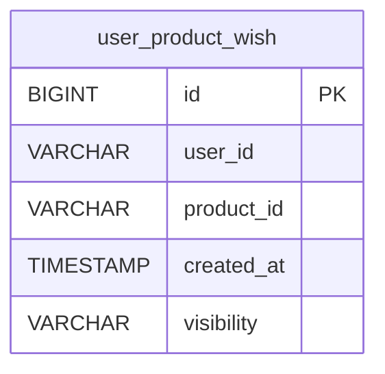
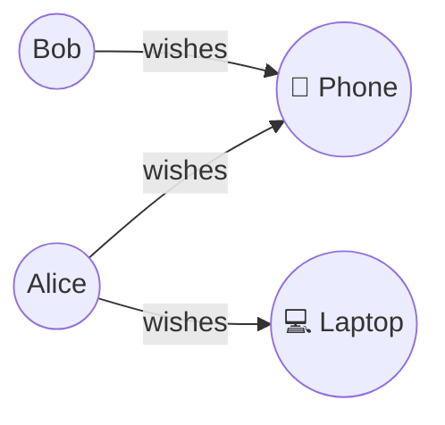

For users familiar with relational databases who want to understand how Actionbase fits alongside an RDB.

## Why Consider Actionbase?

As services grow, tables storing user interactions—likes, recent views, follows—often hit scaling walls:

- Shard key management and hot entities
- Cross-shard queries
- Cache consistency

Actionbase handles these by modeling interactions as **who** did **what** to which **target**, with write-time materialization on horizontally scalable storage.

## From Tables to Interactions

In an RDB, interaction data often lives in tables like:

- `user_follows` (user–user)
- `user_likes` (user–item)
- `user_views` (user–item)

In Actionbase, these become edges:

- **Source**: who (e.g., user_id)
- **Target**: what (e.g., product_id, user_id)
- **Properties**: schema-defined (e.g., `created_at`)

Read-optimized structures (indexes, counts) are pre-computed at write time.

## When Actionbase Fits

- Interaction tables dominate volume
- Queries focus on listing or counting relationships
- Sharding these tables gets painful

## Using Actionbase with an RDB

Actionbase complements an RDB, not replaces it.

A common pattern:

1. Transactional and domain data stays in RDB
2. Large-scale interaction data moves to Actionbase
3. Interaction queries served from Actionbase

Start by migrating only the tables that present scaling challenges.

## Example: Mapping a Table

**RDB**

```sql
CREATE TABLE user_product_wish (
    id BIGINT AUTO_INCREMENT PRIMARY KEY,
    user_id VARCHAR(255),
    product_id VARCHAR(255),
    created_at TIMESTAMP,
    visibility VARCHAR(50)
);
```



**Actionbase**



- **Source**: user_id (STRING)
- **Target**: product_id (STRING)
- **Properties**: `created_at` (LONG), `visibility` (STRING)

The `id` column is not needed—edges are identified by source and target.

Indexes for efficient queries:

- `created_at DESC` — recent wishes
- `visibility, created_at DESC` — filtered by visibility

See [Schema](/design/schema/) and [Quick Start](/quick-start/).
