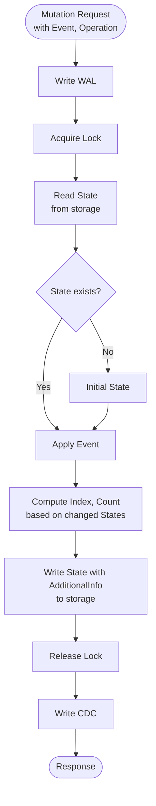
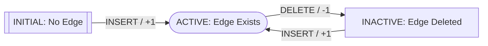

뮤테이션은 엣지의 삽입, 업데이트, 삭제를 수행합니다. 이 과정은 일관성, 내구성, 쓰기 시점 최적화를 보장합니다.

배경 설명은 [핵심 개념](/ko/design/concepts/)을 참조하세요.

## 뮤테이션 흐름 {#mutation-flow}

## 뮤테이션 요청 {#mutation-request}

뮤테이션 요청에는 다음이 포함됩니다:

- **이벤트**: 데이터 변경 사항(예: 새로운 프로퍼티 값, 엣지 생성)
- **작업**: 삽입, 업데이트, 삭제

## 뮤테이션 처리 과정 {#mutation-process}

### 1. WAL 기록 {#1-write-wal}

변경 사항이 적용되기 전에 뮤테이션이 WAL에 기록됩니다. 복구 및 재생을 가능하게 합니다.

프로덕션 환경에서는 WAL 백엔드로 Kafka가 사용됩니다.

### 2. 락 획득 {#2-acquire-lock}

동시 수정을 방지합니다:

- **고유 엣지**: (소스, 타겟)에 대한 락
- **다중 엣지**: 엣지 ID에 대한 락

### 3. 상태 읽기 {#3-read-state}

스토리지에서 현재 상태(프로퍼티, 타임스탬프, 메타데이터)를 읽습니다.

### 4. 이벤트 적용 {#4-apply-event}

작업 및 클라이언트 타임스탬프에 기반한 전환 상태. 자세한 내용은 [상태 전환](#state-transitions)을 참조하세요.

### 5. 인덱스 및 카운터 계산 {#5-compute-indexes-and-counters}

변경된 상태를 기반으로:

- **인덱스**: 기존 인덱스 삭제, 새 인덱스 생성
- **카운터**: 증가 또는 감소

### 6. 스토리지에 쓰기 {#6-write-to-storage}

상태, 인덱스 및 카운터가 원자적으로 기록됩니다.

### 7. 락 해제 {#7-release-lock}

쓰기 후 락이 해제됩니다.

### 8. CDC 기록 {#8-write-cdc}

뮤테이션이 CDC(프로덕션 환경에서는 Kafka)에 기록됩니다. 결과 상태가 다운스트림 시스템에서 사용할 수 있게 됩니다.

## 상태 전환 {#state-transitions}

엣지는 작업(INSERT, DELETE)에 따라 상태가 전환됩니다. 각 이벤트는 클라이언트 타임스탬프를 포함하며, Actionbase는 이 타임스탬프를 사용하여 올바른 최종 상태를 계산합니다. 이는 순서가 뒤바뀐 도착 및 중복 요청(멱등성)에도 적용됩니다.

구현은 [`State.transit`](https://github.com/kakao/actionbase/blob/main/core/src/main/kotlin/com/kakao/actionbase/core/state/StateExtensions.kt)을 참조하세요.

### 다이어그램 {#diagram}

전체 상태 전환 다이어그램

[PlantUML에서 편집](https://www.plantuml.com/plantuml/uml/VPAnRiCW48PtdkAaRbLHcvKXYXKOaAoeIjmkYGTgKpKgmPKDxUlNLiw94JQJBOxlkn-uJUTKw_p5aFx7QP0xMSWi1mQgSkTVpS2UnrgsBUIxc9HSw_MDYwgVodIQaEDZ2PIk9-R3q9AGSO4U7pwCroLTtpiqFwm73c9VdAogAWQhanqQ-Ox1TY-oGl2HHtc0lhtoVWkYBtTKybnC-xQwBcEQYrp4zBZE2S7TwU0HZwbuWAlg6_bq-fZ7_4zrurpY6F0CLlz1qmuVZbAw2ayrOrNTrzKwxsnC3GltI-Gkl22Ck71FGK2PUkxGEec8fT1x3Rau0_4Zf8Se8KXDqG9EDjhM_cB-0G00)

### 예시: 순서가 뒤바뀐 이벤트 {#example-out-of-order-events}

앨리스의 작업: like(t=100) → unlike(t=200) → like(t=300)

이벤트는 순서가 뒤섞여 도착할 수 있습니다: like(t=100) → like(t=300) → unlike(t=200)

| #   | 이벤트 도착 시점 | 상태             | 카운트 변화 | 합계 |
| --- | ---------------- | ---------------- | ----------- | ---- |
| 1   | like (t=100)     | INITIAL → ACTIVE | +1          | 1    |
| 2   | like (t=300)     | ACTIVE → ACTIVE  | 0           | 1    |
| 3   | unlike (t=200)   | ACTIVE → ACTIVE  | 0           | 1    |

최종 상태: **ACTIVE**, 카운트: **1** — 도착 순서와 상관없이 동일한 결과입니다.

## 쓰기 시점 최적화 {#write-time-optimization}

뮤테이션 동안 Actionbase는 미리 계산합니다:

| 구조        | 목적           | 쿼리 유형 |
| ----------- | -------------- | --------- |
| EdgeState   | 현재 엣지 상태 | GET       |
| EdgeIndex   | 정렬된 항목    | SCAN      |
| EdgeCounter | 집계된 카운트  | COUNT     |

읽기는 쿼리 시점의 계산 없이 간단한 GET, COUNT, SCAN을 사용합니다.

## 일관성 보장 {#consistency-guarantees}

| 메커니즘          | 보장 내용                                      |
| ----------------- | ---------------------------------------------- |
| 락킹              | 동시 수정 방지                                 |
| 원자적 쓰기       | 상태와 인덱스가 함께 기록됨                    |
| WAL               | 내구성 및 복구                                 |
| Read-Modify-Write | 최신 상태를 기반으로 한 뮤테이션               |
| State Transitions | 이벤트 도착에도 불구하고 올바른 최종 상태 유지 |
| Idempotency       | 재실행해도 동일한 결과 생성                    |

## 다음 단계 {#next-steps}

- [쿼리](/ko/design/query/): 사전 계산된 데이터 읽기
- [뮤테이션 API](/ko/api-references/mutation/): API 참조
