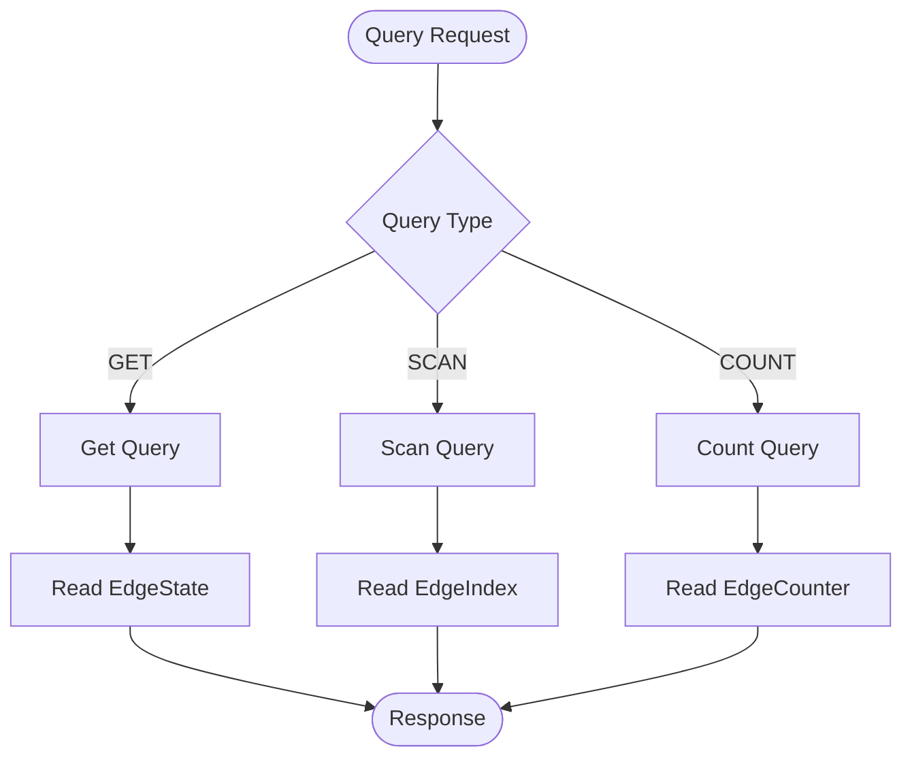

쿼리는 뮤테이션 중에 미리 계산된 데이터를 조회합니다.

배경 설명은 [핵심 개념](/ko/design/concepts/)을 참고하세요.

## 미리 계산된 구조 {#pre-computed-structures}

| 구조        | 생성 시점 | 접근 방법 |
| ----------- | --------- | --------- |
| EdgeState   | 뮤테이션  | GET       |
| EdgeIndex   | 뮤테이션  | SCAN      |
| EdgeCounter | 뮤테이션  | COUNT     |

쿼리 유형과 인덱스를 지정합니다. 각 쿼리는 쓰기 시점에 준비된 구조에 접근합니다.

## 쿼리 유형 {#query-types}

### GET {#get}

소스 및 타겟으로 엣지 상태를 조회합니다.

**사용 사례**: "이 사용자가 이 상품을 본 적이 있나요?"

**처리 과정**:

1. 소스와 타겟에서 EdgeState 키를 구성합니다
2. 엣지 상태를 반환합니다

**MGet**:

- 여러 소스 또는 타겟 ID → 멀티-겟
- 요청당 최대 25개의 엣지
- 패턴: 1개의 소스에 N개의 타겟, 또는 M개의 소스에 1개의 타겟

### SCAN {#scan}

사전 계산된 인덱스를 사용하여 범위 필터링과 페이징을 적용해 엣지를 스캔합니다.

**사용 사례**: "이 사용자가 본 최근 상품"

**처리 과정**:

1. 소스, 테이블, 방향, 인덱스를 기반으로 EdgeIndex 키 접두사를 구성합니다.
2. 범위 필터를 적용합니다.
3. 인덱스 항목을 스캔합니다.
4. 선택적 필터를 적용합니다.
5. 페이징(제한, 오프셋)을 적용합니다.
6. 일치하는 엣지를 반환합니다.

**인덱스 요구사항**:

- 사용할 인덱스를 반드시 지정해야 합니다.
- 인덱스는 스키마에 정의되어 있어야 합니다.

### COUNT {#count}

소스 노드에 대한 엣지 개수를 반환합니다.

**사용 사례**: "이 사용자가 본 상품이 몇 개인가요?"

**처리 과정**:

1. 소스, 테이블, 방향을 기반으로 EdgeCounter 키를 구성합니다.
2. 미리 계산된 카운터 반환

## 쿼리 흐름 {#query-flow}



## 인덱스 범위 {#index-ranges}

SCAN 쿼리는 스토리지 수준에서 필터링할 범위를 지정할 수 있습니다.

| 개념          | 설명                                           |
| ------------- | ---------------------------------------------- |
| 명시적 인덱스 | 어떤 인덱스를 지정해야 함                      |
| 연산자        | `eq`, `gt`, `lt`, `between`이 스캔 범위를 설정 |
| 인덱스 순서   | 필드 순서대로 범위가 적용됨                    |
| 정렬 방향     | 연산자 의미는 ASC/DESC에 따라 달라짐           |

### 범위 vs 필터 {#range-vs-filter}

| 유형 | 레벨         | 인덱스 사용 | 성능         |
| ---- | ------------ | ----------- | ------------ |
| 범위 | 스토리지     | 예          | 빠름         |
| 필터 | 애플리케이션 | 아니요      | 조회 후 적용 |

## 페이지네이션 {#pagination}

| 매개변수 | 설명                   |
| -------- | ---------------------- |
| offset   | 인코딩된 시작 위치     |
| limit    | 최대 결과 수 (25 권장) |
| hasNext  | 더 많은 결과 사용 가능 |

## 쿼리 방향 {#query-direction}

| 방향 | 설명          | 예시                 |
| ---- | ------------- | -------------------- |
| OUT  | 나가는 엣지   | 사용자가 좋아한 상품 |
| IN   | 들어오는 엣지 | 상품을 좋아한 사용자 |

각 방향별로 별도의 인덱스 및 카운터가 유지됩니다.

## 읽기 경로 {#read-path}

```
Client → Server → Engine → Storage → Response
```

1. **클라이언트**: REST API를 통한 쿼리
2. **서버**: 요청 검증
3. **엔진**: 키 구성, 데이터 조회
4. **스토리지**: EdgeState/EdgeIndex/EdgeCounter 반환
5. **응답**: 클라이언트로 반환

## 다음 단계 {#next-steps}

- [가이드](/ko/guides/build-your-social-media-app/): 실습 튜토리얼
- [쿼리 API](/ko/api-references/query/): API 참조
