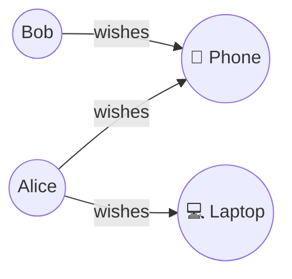

관계형 데이터베이스를 사용하는 사용자가 Actionbase가 RDB와 어떻게 연계되는지 이해하고자 할 때

## Actionbase를 고려해야 하는 이유 {#why-consider-actionbase}

서비스가 성장함에 따라, 좋아요, 최근 조회, 팔로우와 같은 사용자 인터랙션 데이터를 저장하는 테이블이 종종 확장 한계에 부딪힙니다:

- 샤드 키 관리와 핫 엔티티
- 샤드 간 쿼리
- 캐시 일관성

Actionbase는 이러한 문제를 **누가** 어떤 **대상**에 대해 어떤 **행위**를 했는지 모델링하고, 쓰기 시점에 수평 확장 가능한 스토리지에 실시간 머티리얼라이제이션을 적용하여 해결합니다.

## 테이블에서 인터랙션으로 전환 {#from-tables-to-interactions}

RDB에서는 인터랙션 데이터가 다음과 같은 테이블에 저장되는 경우가 많습니다:

- `user_follows` (사용자-사용자)
- `user_likes` (사용자-아이템)
- `user_views` (사용자-아이템)

Actionbase에서는 이것들이 엣지로 변환됩니다:

- **소스**: 누가 (예: user_id)
- **타겟**: 무엇을 (예: product_id, user_id)
- **프로퍼티**: 스키마 정의 (예: `created_at`)

읽기 최적화 구조(인덱스, 카운트 등)는 쓰기 시점에 미리 계산됩니다.

## Actionbase가 적합한 경우 {#when-actionbase-fits}

- 인터랙션 테이블이 데이터 볼륨을 주도합니다.
- 쿼리는 관계 목록을 조회하거나 개수를 세는 데 집중합니다.
- 이러한 테이블을 샤딩하면 문제가 발생합니다.

## RDB와 함께 Actionbase를 사용합니다. {#using-actionbase-with-an-rdb}

Actionbase는 RDB를 대체하는 것이 아니라 보완합니다.

일반적인 패턴은 다음과 같습니다:

1. 트랜잭션 및 도메인 데이터는 RDB에 유지합니다.
2. 대규모 인터랙션 데이터는 Actionbase로 이동합니다.
3. 인터랙션 쿼리는 Actionbase에서 제공됩니다.

먼저 확장성 문제가 발생하는 테이블만 마이그레이션하세요.

## 예시: 테이블 매핑 {#example-mapping-a-table}

**RDB**

```sql
CREATE TABLE user_product_wish (
    id BIGINT AUTO_INCREMENT PRIMARY KEY,
    user_id VARCHAR(255),
    product_id VARCHAR(255),
    created_at TIMESTAMP,
    visibility VARCHAR(50)
);
```

**Actionbase**



- **Source**: user_id (STRING)
- **Target**: product_id (STRING)
- **Properties**: `created_at` (LONG), `visibility` (STRING)

`id` 컬럼은 필요하지 않습니다. 고유한 엣지는 source와 target으로 식별됩니다.

> **참고**: 다중 엣지 케이스(예: 동일한 사용자가 동일한 수신자에게 여러 번 선물한 경우)에서는 각 엣지에 고유한 `id`가 필요합니다. [FAQ](/ko/faq/#what-is-the-difference-between-unique-edge-and-multi-edge)를 참조하세요.

효율적인 쿼리를 위한 인덱스:

- `created_at DESC` — 최근 위시리스트를 빠르게 조회합니다.
- `visibility, created_at DESC` — visibility(으)로 필터링됨

## 다음 단계 {#next-steps}

- [스키마](/ko/design/schema/) — 엣지 스키마를 정의하세요
- [빠른 시작](/ko/quick-start/) — Actionbase를 몇 분 만에 체험해보세요
