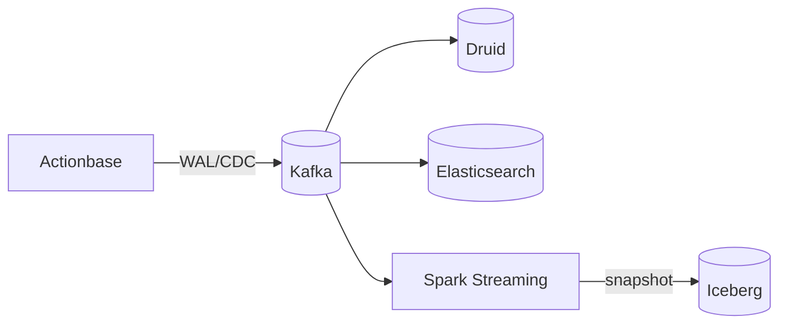

> 이 스토리에서는 카카오가 내부적으로 Actionbase를 어떻게 활용하는지 공유합니다. 이러한 컴포넌트들을 오픈 소스로 공개할 예정이니 [로드맵](https://github.com/kakao/actionbase/blob/main/ROADMAP.md)을 참고하세요.

이 스토리는 **통합 파이프라인** 패턴을 보여줍니다. Actionbase가 자체적으로 요구사항을 구현하지 않으면서도, 어떻게 다운스트림 요구사항을 충족하는지 설명합니다.

## 도전 과제 {#the-challenge}

Actionbase는 OLTP에 최적화되어 있습니다. 즉, 사용자 대상의 빠른 읽기와 쓰기를 지원합니다. 하지만 팀들은 더 많은 기능이 필요합니다.

- 분석 및 대시보드
- 사기 탐지
- ML 학습 데이터
- 운영(고객 지원, 재해 복구)

이러한 기능들을 Actionbase에 직접 구현하면 핵심 미션이 훼손됩니다. 그렇다고 이를 무시하는 것도 불가능합니다.

## 전략 {#the-strategy}

해답은 이벤트 스트리밍을 통한 위임입니다.

Actionbase의 모든 변경(mutation)은 WAL과 CDC 이벤트를 생성합니다. 이 이벤트들을 Kafka로 발행함으로써, Actionbase는 다운스트림 요구사항을 전문화된 시스템에 위임하면서도 본연의 역할에 집중할 수 있습니다.

### WAL/CDC를 Kafka로 발행 {#walcdc-to-kafka}

Actionbase는 두 지점에서 이벤트를 Kafka로 발행합니다.

- WAL: 변경 요청 자체를 그대로 발행—상태를 재구축하기 위한 재생(idempotent)
- CDC: 처리 후 저장된 결과를 발행—현재 스냅샷을 누적

전체 흐름은 [뮤테이션](/ko/design/mutation/)에서 확인할 수 있습니다.

### 분석 백엔드 {#analytics-backends}

다양한 백엔드가 각기 다른 요구 사항을 충족합니다:

- Spark Streaming: 복잡한 이벤트 처리, 주기적인 배치 작업
- Druid: 실시간 집계, 대시보드
- Elasticsearch: 실시간 로그 검색, 이벤트별 조회(WAL/CDC)
- OLAP 엔진(Presto, Hive 등): 대규모 데이터셋에 대한 애드혹 쿼리

### 스냅샷 {#snapshots}

원래는 Spark Streaming이 주기적으로 Kafka에 데이터를 덤프하고, Spark Batch가 스냅샷을 생성했습니다. 최근에는 더 효율적인 저장을 위해 Iceberg로 마이그레이션 중입니다.

## 이것이 가능하게 하는 것 {#what-this-enables}

WAL/CDC를 게시함으로써 Actionbase는 이를 직접 구현하지 않지만, 가능하게 만듭니다:

CDC 컨슈머(현재 상태):

- 분석: OLAP 쿼리, 대시보드, 인사이트 추출
- 사기 탐지: 악용 패턴, 이상 탐지
- 머신러닝: 추천 학습을 위한 데이터
- 고객 지원: 모든 변경 사항이 Elasticsearch에 저장되어 단기 CS 쿼리에 활용

WAL 컨슈머(재실행):

- 비동기 처리: [최근 보기](/ko/stories/use-cases/kakaotalk-gift-recent-views/)가 WAL을 소비하고 변경 사항을 다시 전송합니다
- 운영: 데이터 마이그레이션, 재해 복구, 일관성 검사

Actionbase는 OLTP에 집중합니다. 요구 사항은 여전히 위임(delegation)을 통해 충족됩니다.

## 우리가 배운 점 {#what-we-learned}

- 한 가지 일을 잘하자. Actionbase는 OLTP를 처리하고, 전문화된 시스템이 나머지를 담당합니다.
- 이벤트는 통합 계층입니다. WAL/CDC에서 Kafka로 프로듀서와 컨슈머가 분리됩니다.
- 위임은 요구 사항을 충족합니다. 모든 것을 직접 구축할 필요가 없습니다.

이 패턴을 통해 Actionbase는 핵심 기능에 집중하면서도 그 범위를 훨씬 넘어서는 기능을 구현할 수 있습니다.
