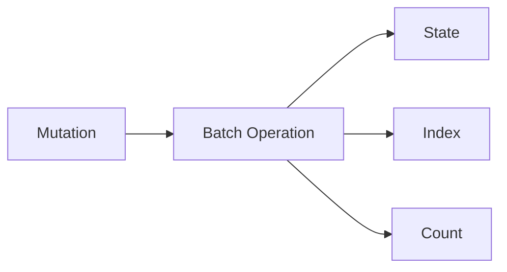
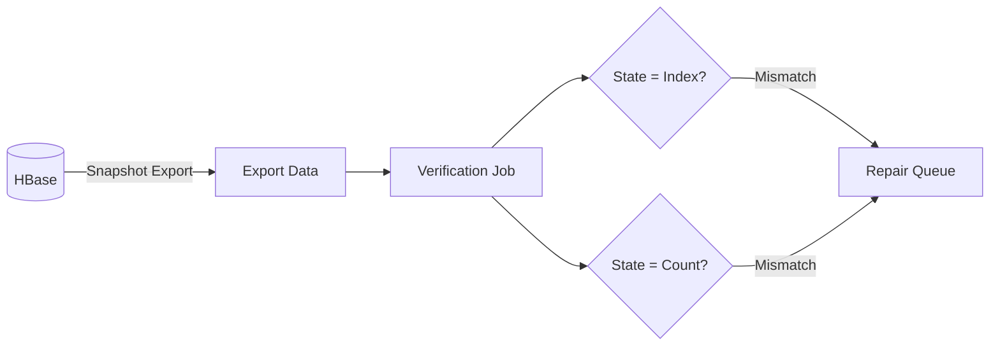

이 스토리는 **주기적 검증** 패턴을 보여줍니다: 운영 중 발생할 수 있는 데이터 불일치를 감지하고 보정하는 방법입니다.

## 왜 필요했나 {#why-we-needed-this}

배포했습니다. 마이그레이션도 검증했습니다. 하지만 운영 중에도 데이터 불일치가 발생할 수 있습니다. 분산 시스템에서 완벽한 원자성은 없습니다.

## 데이터 구조 {#data-structure}

Actionbase는 HBase에 세 가지 데이터를 저장합니다:

- **State**: 원천 데이터 - 실제 엣지 레코드
- **Index**: 쿼리를 위한 파생 데이터
- **Count**: 집계 데이터

하나의 뮤테이션이 State, Index, Count를 한 번에 갱신합니다.

## 정합성 문제 {#consistency-problem}

HBase 배치 오퍼레이션은 원자적이지 않습니다. 리전 서버가 중간에 실패하거나 네트워크 문제로 부분 쓰기가 발생하면, 일부만 갱신될 수 있습니다.

State는 갱신됐는데 Index는 안 됐다면? 쿼리가 틀린 결과를 반환합니다.

## 동작 방식 {#how-it-works}

주기적으로 검증합니다.

HBase 스냅샷을 익스포트해서 검증 작업을 돌립니다:

- **State vs Index**: 모든 state에 해당하는 index가 있는지
- **State vs Count**: 집계가 실제 레코드 수와 일치하는지

## 보정 {#correction}

불일치가 감지되면 보정합니다. State가 정답입니다. Index와 Count는 State로부터 재생성할 수 있습니다.

보정 주기는 서비스 SLA에 따라 결정합니다.

## 배운 점 {#what-we-learned}

- **완벽한 원자성을 기대하지 않는다.** 분산 시스템에서 부분 실패는 발생합니다. 이를 감지하고 보정하는 메커니즘이 필요합니다.
- **State가 정답.** 파생 데이터(Index, Count)는 언제든 State로부터 재생성할 수 있도록 설계합니다.
