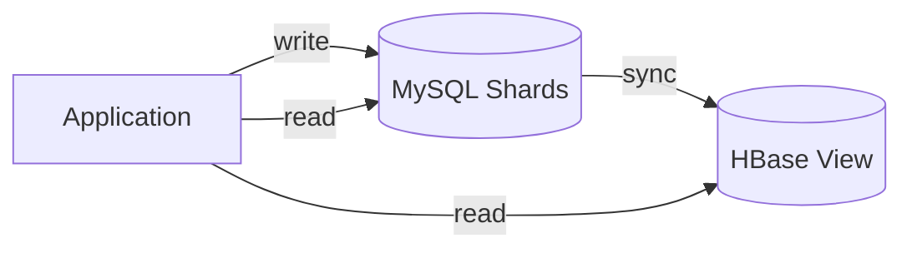
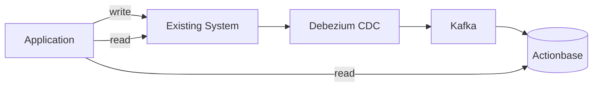

이 사례는 **CQRS(명령 쿼리 책임 분리)** 패턴을 보여줍니다: Actionbase가 카카오톡 친구 관계의 읽기 최적화 뷰 계층으로 어떻게 활용되었는지 설명합니다.

## 과제 {#the-challenge}

카카오톡의 친구 관계는 수십 개의 샤딩된 MySQL 데이터베이스에 분산 저장되어 있습니다. 읽기 중심의 쿼리를 처리하기 위해 이미 HBase 기반 뷰 계층이 구축되어 있었습니다:

기존에는 이 구조가 목적에 맞게 잘 동작했습니다. 하지만 요구사항이 진화하면서 다음과 같은 한계가 드러났습니다:

- HBase 뷰는 특정 접근 패턴에 맞춰 설계됨
- 새로운 쿼리 유형과 스키마 변경에 대한 유연성 부족

Actionbase는 여기서 기존 시스템을 대체하는 것이 아니라, 추가적인 뷰 계층으로 검증할 기회를 얻었습니다.

## 통합 전략 {#integration-strategy}

기존 시스템을 대체하지 않고, Actionbase를 함께 추가했습니다:

핵심 인사이트: Actionbase는 진실의 원천(source of truth)이 될 필요가 없습니다. CDC를 통해 변경 사항을 소비하는 유연한 뷰 계층으로 동작할 수 있습니다. 기존 시스템(MySQL + HBase)은 변경되지 않았습니다.

### 1단계: CDC 파이프라인 {#stage-1-cdc-pipeline}

먼저 데이터 흐름을 구축했습니다. Debezium이 MySQL 샤드의 변경 사항을 캡처해 Kafka로 발행하면, Actionbase가 이 이벤트를 소비하고 뮤테이션을 적용합니다.

### 2단계: 대량 적재 {#stage-2-bulk-load}

과거 데이터를 위해 다음과 같은 절차를 진행했습니다:

1. MySQL 테이블을 덤프
2. Actionbase에 대량 적재
3. 덤프 중 발생한 변경 사항을 따라잡기 위해 WAL을 재생

> **참고:** 마이그레이션 파이프라인(대량 적재)은 현재 내부적으로만 운영 중입니다. 오픈소스 공개는 진행 중이며, [로드맵](/ko/community/roadmap/)을 참고하세요.

이로 인해 다운타임 없이 일관된 스냅샷을 얻을 수 있었습니다.

### 3단계: 새로운 쿼리 레이어 {#stage-3-new-query-layer}

Actionbase가 도입되면서 새로운 시스템들은 모든 쿼리 유형(get, scan, count, reverse)을 단일 스키마 정의를 통해 Actionbase에 요청했습니다.

## 우리가 배운 점 {#what-we-learned}

- **Actionbase는 CQRS 뷰로 작동합니다.** 데이터에 대한 소유권을 가지지 않아도 가치를 더할 수 있습니다.
- **CDC를 통해 비침습적 통합이 가능합니다.** 쓰기 경로에 변경이 필요하지 않았습니다.
- **스키마의 유연성으로 새로운 사용 사례가 열립니다.** 단일 스키마 정의만으로 get, scan, count, reverse가 모두 가능합니다.

이 패턴을 통해 마이그레이션 위험 없이 기존 시스템과 함께 Actionbase를 추가할 수 있는 길이 열렸습니다.
