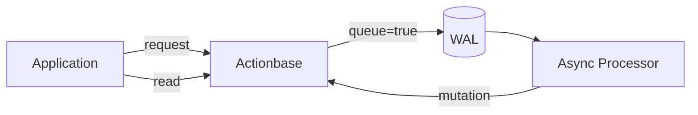

이 사례에서는 **비동기 처리** 패턴을 소개합니다: Actionbase가 카카오톡 선물하기의 최근 본 조회에 대해 어떻게 고빈도 쓰기를 처리했는지 보여줍니다.

## 과제 {#the-challenge}

최근 본 조회는 다른 인터랙션과 다릅니다. 사용자가 상품을 볼 때마다 조회 이벤트가 생성되며, 쓰기량이 좋아요나 찜보다 훨씬 많습니다.

이러한 쓰기를 사용자-facing 요청 경로에서 동기적으로 처리하면 다음과 같은 문제가 발생합니다:

- 응답 지연 시간 증가
- 트래픽 급증 시 백프레셔 발생
- 부하 상황에서 서비스 품질 저하 위험

Actionbase는 사용자 경험에 영향을 주지 않으면서 높은 쓰기 처리량을 흡수할 수 있는 패턴이 필요했습니다. Actionbase는 이 기회를 통해 실력을 입증할 수 있었습니다.

## 비동기 전략 {#async-strategy}

뮤테이션을 동기적으로 처리하는 대신 비동기 처리를 사용했습니다:

핵심 인사이트는 확인(acknowledgment)과 처리를 분리하는 데 있습니다. 사용자는 즉시 응답을 받고, 실제 뮤테이션은 백그라운드에서 처리됩니다.

### 1단계: WAL로 큐잉 {#stage-1-queue-to-wal}

먼저 조회 이벤트가 도착하면 Actionbase는 `queue=true`로 WAL에 기록하고 즉시 반환합니다. 락도 없고 상태 계산도 없으며, 단순히 로그에 추가합니다.

### 2단계: 처리 {#stage-2-processing}

다음으로 Spark Streaming 작업이 WAL 엔트리를 소비하여 Actionbase로 뮤테이션을 다시 전송합니다. 프로세서는 다음과 같은 작업을 수행합니다:

- 효율성을 위해 이벤트를 배치 처리
- 트래픽 급증 시 쓰로틀링 적용
- 일시적 실패 시 재시도 수행

> **참고:** 비동기 프로세서는 현재 내부적으로만 사용됩니다. 오픈 소스 릴리스는 진행 중이며, [로드맵](/ko/community/roadmap/)을 참고하세요.

### 3단계: 백그라운드 뮤테이션 {#stage-3-background-mutation}

마지막으로, Actionbase가 백그라운드에서 뮤테이션을 처리합니다. 락을 획득하고, 상태를 업데이트하며, 인덱스와 카운트를 계산합니다. 데이터는 일반적으로 수십 밀리초 이내에 반영됩니다.

## 우리가 배운 점 {#what-we-learned}

- **비동기 처리는 쓰기 급증을 부드럽게 처리합니다.** WAL이 버스트를 흡수하고, 프로세서가 지속 가능한 속도로 데이터를 처리합니다.
- **즉시 응답이 사용자 경험을 향상시킵니다.** 사용자는 전체 뮤테이션 주기를 기다릴 필요가 없습니다.
- **최종 일관성은 일부 사용 사례에 적합합니다.** 최근 본 조회는 실시간 정확성이 필요하지 않으며, 수십 밀리초의 지연은 허용됩니다.

이 패턴은 카카오에서 고빈도 상호작용의 템플릿이 되었습니다.
