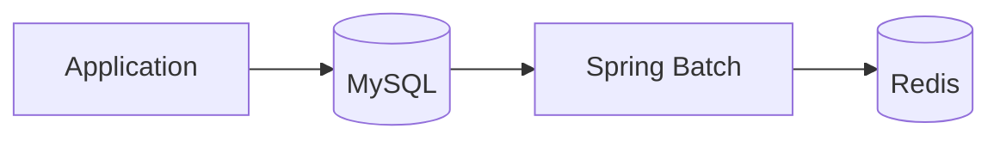
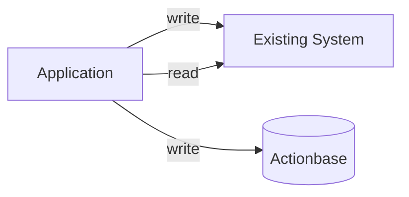
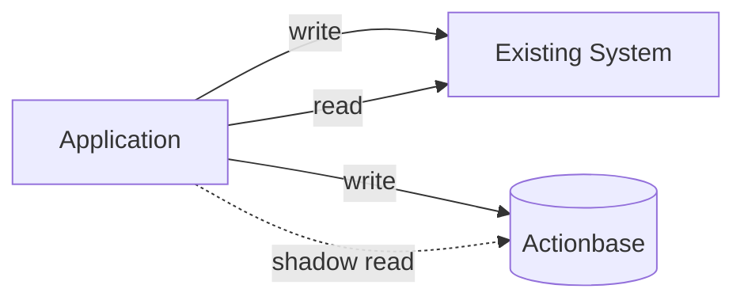
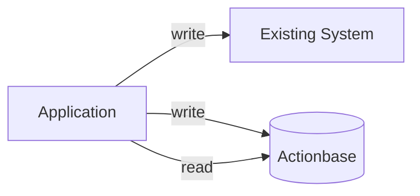
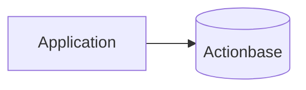

이 사례는 **SSOT(단일 소스 오브 트루스) 패턴**을 보여줍니다: 카카오톡 선물하기의 위시가 Actionbase의 첫 프로덕션 배포가 된 과정을 설명합니다.

## 과제 {#the-challenge}

카카오톡 선물하기의 위시는 사용자가 받고 싶은 선물을 저장할 수 있게 했습니다. 기존 아키텍처는 다음과 같았습니다:

- **MySQL**이 위시 데이터를 저장하고 조회(조회, 스캔, 사용자별 카운트) 쿼리를 제공했습니다.
- **Spring Batch**가 역방향 카운트(각 상품별 몇 명의 사용자가 위시했는지)를 집계했습니다.
- **Redis**가 역방향 카운트를 캐시하여 빠른 읽기를 지원했습니다.

처음에는 잘 동작했지만, 트래픽이 증가하면서 다음과 같은 확장성 한계에 부딪혔습니다:

- 테이블 크기가 편안한 한계를 넘어 커졌습니다.
- MySQL과 Redis 간 데이터 일관성 유지가 점점 복잡해졌습니다.

MySQL 샤딩을 고려했지만, 샤딩은 샤드 키 관리, 샤드 간 쿼리, 운영 부담 등 자체적인 복잡성을 가져옵니다. Actionbase가 이를 증명할 기회가 있었습니다.

## 마이그레이션 전략 {#migration-strategy}

스위치 한 번으로 전환하지 않았습니다. 마이그레이션은 수개월에 걸쳐 신중하게 단계적으로 진행되었습니다.

### 1단계: 이중 쓰기 {#stage-1-dual-write}

먼저 Actionbase를 기존 시스템(MySQL + Redis)과 함께 쓰기 대상으로 추가했습니다. 읽기는 여전히 기존 시스템에서 제공했습니다.

기존 데이터에 대해서는 다음과 같이 처리했습니다:

1. MySQL 테이블을 덤프했습니다.
2. Actionbase에 대량 적재했습니다.
3. 덤프 도중 발생한 쓰기를 반영하기 위해 WAL을 재생했습니다.

> **참고:** 마이그레이션 파이프라인(대량 적재)은 현재 내부적으로만 운영 중입니다. 오픈 소스 공개가 진행 중이며, 자세한 내용은 [로드맵](/ko/community/roadmap/)을 참고하세요.

이로 인해 다운타임 없이 일관된 스냅샷을 확보할 수 있었습니다.

### 2단계: 검증 {#stage-2-validation}

한 달 동안 다음과 같이 비교했습니다:

- MySQL 덤프(진실의 원천)
- Actionbase CDC 기반 스냅샷

데이터가 일치했습니다. 일관성에 대한 확신을 가질 수 있었습니다.

### 3단계: 이중 읽기 {#stage-3-dual-read}

다음으로, Actionbase에 그림자 읽기(shadow reads)를 추가했습니다. 즉, Actionbase를 호출하되 그 결과를 사용하지 않았습니다. 이로써 Actionbase가 사용자 영향 없이 실제 트래픽 패턴을 처리할 수 있는지 검증했습니다.

### 4단계: 읽기 전환 {#stage-4-read-cutover}

트래픽 처리가 확인된 후, 읽기를 Actionbase로 전환했습니다. 이 시점에서 Actionbase가 진실의 원천이 되었습니다. 기존 시스템은 백업으로 남아 있었고, 문제가 발생하면 즉시 롤백할 수 있었습니다.

### 5단계: 정리 {#stage-5-cleanup}

몇 달 후, 문제가 전혀 발생하지 않아 기존 시스템을 완전히 제거했습니다:

더 이상 배치 작업이 없습니다. 더 이상 일관성 문제도 없습니다. 이제 Actionbase만 남았습니다.

## 우리가 배운 점 {#what-we-learned}

- **점진적 마이그레이션은 리스크를 줄입니다.** 이중 쓰기, 그다음 이중 읽기, 마지막으로 전환. 각 단계에서 다음 단계를 검증합니다.
- **롤백 경로를 항상 열어두세요.** 전환 후에도 기존 시스템을 몇 달간 유지했습니다. 마음의 평화가 중요합니다.
- **WAL 재생을 통해 무중단 대량 적재가 가능합니다.** 덤프, 적재, 재생—데이터 손실 없이 진행됩니다.

이 패턴이 카카오에서 진실의 원천 마이그레이션의 템플릿이 되었습니다.
