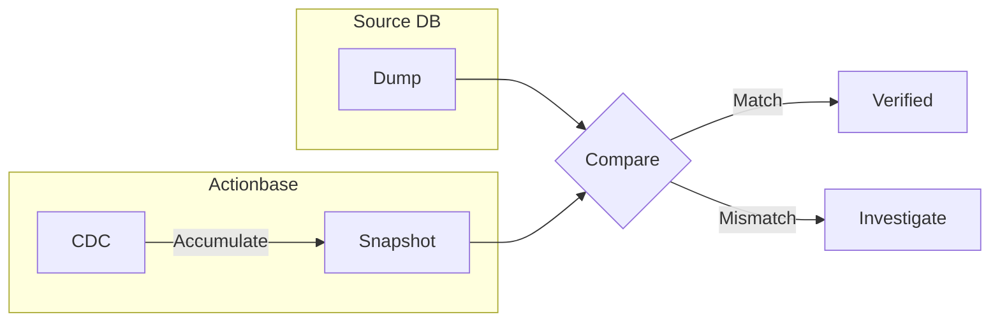

이 스토리는 **비교 검증** 패턴을 보여줍니다: 기존 시스템에서 Actionbase로 데이터를 마이그레이션할 때 정합성을 검증하는 방법입니다.

## 왜 필요했나 {#why-we-needed-this}

기존 시스템에서 Actionbase로 데이터를 마이그레이션합니다. 데이터가 제대로 옮겨졌는지 어떻게 확신할 수 있을까요?

한 번에 모든 데이터를 이관하지 않았습니다. [카카오톡 선물하기 위시](/ko/stories/kakaotalk-gift-wish/)의 경우, 5개의 단계를 거쳤습니다. 각 단계마다 검증하고, 다음 단계로 진행했습니다.

## 동작 방식 {#how-it-works}



두 개의 데이터 소스를 비교합니다:

1. **Source DB Dump**: 원본 데이터베이스에서 직접 익스포트
2. **Actionbase CDC Snapshot**: Actionbase CDC의 "after" 값을 누적

둘이 일치하면 다음 단계로 진행합니다. 불일치하면 멈추고 조사합니다.

## 경계 조건 처리 {#boundary-handling}

Source DB Dump와 CDC Snapshot의 시점이 정확히 일치하지 않습니다. 경계 데이터가 존재합니다.

경계 데이터는 현재 검증 윈도우에서 제외합니다. 검증 윈도우가 `T-1`일 00:00 ~ 23:59라면, 경계 데이터는 다음 윈도우 `T`일에 검증됩니다. 윈도우가 슬라이딩하면서 모든 데이터가 검증됩니다.

## 왜 CDC Snapshot인가 {#why-cdc-snapshot}

HBase를 직접 읽어서 비교할 수도 있습니다. 하지만 CDC Snapshot은 독립적인 경로로 만들어진 데이터입니다.

```
Source DB → Actionbase → HBase → CDC → Snapshot
```

이 전체 파이프라인이 정상 동작해야만 일치합니다. 파이프라인 어딘가에서 문제가 생기면 불일치가 발생합니다.

## 배운 점 {#what-we-learned}

- **독립적인 소스로 검증.** 같은 데이터를 다른 경로로 만들어서 비교합니다. 일치하면 전체 파이프라인이 정상입니다.
- **단계별 진행.** 한 번에 모든 데이터를 이관하지 않습니다. 각 단계마다 검증하고 다음으로 진행합니다.
