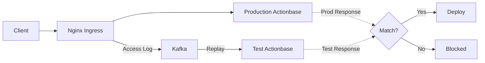
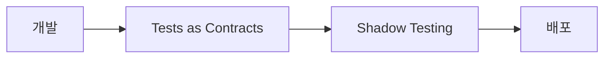

이 스토리는 **Shadow Testing** 패턴을 보여줍니다: 프로덕션 트래픽을 미러링하여 배포 전 최종 검증하는 방법입니다.

## 왜 필요했나 {#why-we-needed-this}

[Tests as Contracts](/ko/stories/contracts/)를 통과했습니다. 하지만 테스트가 커버하지 못하는 영역이 있습니다:

- 특정 데이터 조합에서만 발생하는 버그
- 트래픽 패턴에 따른 성능 문제
- 프로덕션 데이터 규모에서만 드러나는 이슈
- Contract에 명시되지 않은 동작을 사용하는 클라이언트

테스트 환경에서는 만들어낼 수 없는 조건들입니다.

## 동작 방식 {#how-it-works}

프로덕션 Actionbase 앞단의 Nginx Ingress가 모든 요청과 응답을 Access Log로 기록합니다. 이 로그를 Kafka로 보내고, 같은 요청을 테스트 환경에 재생합니다. 로그 기반이라 실제 서비스 트래픽에는 영향이 없습니다.

1. **Capture**: Nginx Ingress가 요청과 응답을 Access Log로 Kafka에 기록
2. **Replay**: 같은 요청을 테스트 환경에 재생
3. **Compare**: 프로덕션 응답과 테스트 응답 비교
4. **Gate**: 불일치 시 배포 차단

## 배포 프로세스 {#deployment-process}

두 단계를 모두 통과해야 배포가 진행됩니다.

## 배운 점 {#what-we-learned}

- **실제 트래픽은 대체할 수 없다.** 아무리 정교한 테스트 시나리오도 프로덕션 트래픽 패턴을 완벽히 재현하지 못합니다.
- **배포 전 마지막 관문.** Tests as Contracts와 Shadow Testing을 모두 통과해야 배포할 수 있습니다.
