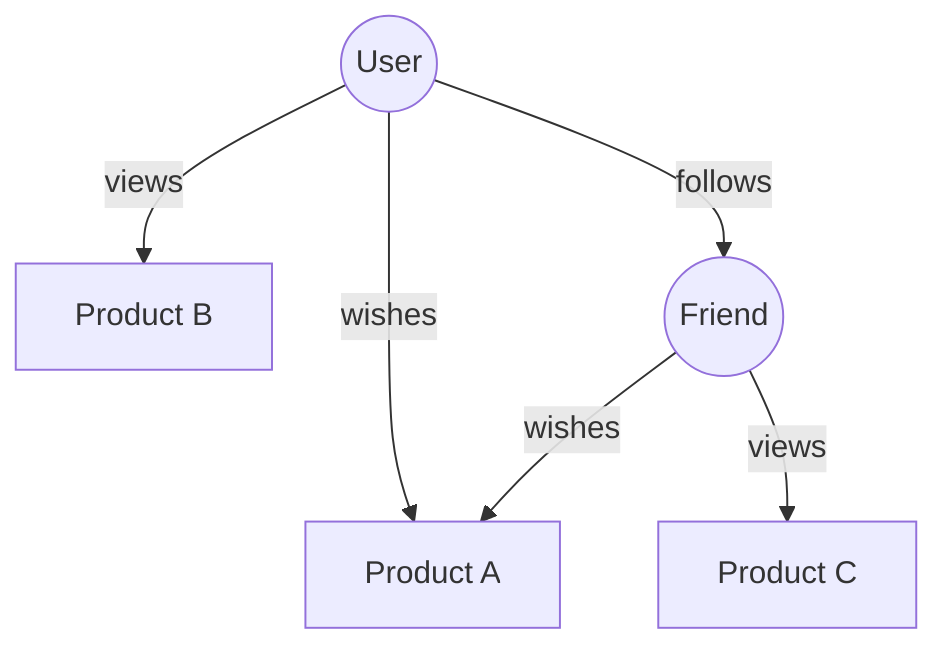

이것이 Actionbase가 지향하는 방향과 우리가 해결하고자 하는 문제에 대한 이야기입니다.

## 패턴 {#the-pattern}

지금까지의 이야기를 살펴보면:

- **위시** — 사용자가 받고 싶은 선물을 저장하는 기능
- **최근 본 상품** — 사용자가 상품을 조회하는 기능
- **친구** — 사용자가 다른 사용자와 연결되는 기능

각각 처음에는 독립된 기능이었습니다. 서로 다른 팀, 서로 다른 테이블, 서로 다른 확장 전략을 사용했습니다. 하지만 데이터 모델링 관점에서 보면 이들은 동일한 구조를 공유합니다:

**누가** **무엇을** 어떤 **대상**에게 했는지

## 수렴 {#the-convergence}

더 많은 기능이 Actionbase를 채택함에 따라 구조가 드러납니다:



개별 엣지들이 누적됩니다. 한때 여러 데이터베이스에 흩어져 있던 것들이 연결된 그래프로 변합니다:

- 상품들이 사용자 주변에 연결됩니다
- 사용자들이 서로 연결됩니다
- 전체 서비스의 흐름이 가시화됩니다

## 문제 {#the-problem}

오늘날 각 기능은 자신의 조각만 조회합니다:

- "내가 무엇을 위시했나요?"
- "내가 최근에 무엇을 봤나요?"
- "누구를 팔로우해야 하나요?"

하지만 다음 질문은 어떨까요: **"내 친구들이 어떤 소원을 빌었나요?"**

이 쿼리는 Friends와 Wish라는 두 가지 기능을 아우릅니다. 그래프를 탐색해야 합니다. 내 친구를 가져온 다음, 각 친구의 소원을 가져와야 합니다. 현재로서는 대규모로 이 작업을 효율적으로 처리할 수 있는 시스템이 없습니다. 이것이 우리가 해결하려는 문제이며, 처음부터 [우리의 비전](/ko/blog/open-source-announcement/)이기도 했습니다:

> 데이터가 Actionbase에 모이면 이전에는 볼 수 없었던 가능성을 발견할 수 있습니다.

"내 친구들이 어떤 소원을 빌었나요?"는 바로 그런 가능성 중 하나입니다.

## 현재 위치 {#where-we-are}

2026년에 우리는 이를 현실로 만들 준비를 하고 있습니다. 각 채택마다 구조가 확장됩니다. 각 엣지마다 그래프가 더욱 풍부해지며, [로드맵](https://github.com/kakao/actionbase/blob/main/ROADMAP.md)을 참고하세요.

## 기술 노트 {#technical-notes}

### `EdgeIndex`: Narrow Rows {#edgeindex-narrow-rows}

Actionbase는 Scan에 최적화된 좁은 행 구조인 `EdgeIndex`를 사용합니다. 왜 처음부터 넓은 행을 사용하지 않을까요? 좁은 행은 용량을 늘리려면 노드를 추가하기만 하면 되기 때문입니다.

```
Row Key: salt | source | tableCode | direction | indexCode | indexValues | target
Qualifier: "e" (fixed)
Value: version | properties
```

각 엣지는 하나의 행입니다. 단일 홉 쿼리("내가 어떤 소원을 빌었나요?")는 잘 동작합니다. 소스 접두사로 하나의 Scan만 수행하면 모든 엣지를 가져올 수 있습니다.

### `EdgeCache`: Wide Rows (Planned) {#edgecache-wide-rows-planned}

왜 다중 홉 쿼리가 어려울까요? 좁은 행에서는 "내 친구들이 어떤 소원을 빌었나요?" 쿼리를 위해 내 친구 N명을 가져온 다음, 각 친구별로 N번의 Scan이 필요합니다. N번의 RPC는 확장성이 떨어집니다.

넓은 행은 이를 해결합니다:

```
Row Key: salt | source | tableCode | direction | indexCode
Qualifier: indexValues | target
Value: version | properties
```

넓은 행에서는 한 소스에 대한 모든 엣지가 별도의 컬럼으로 하나의 행에 저장됩니다. N명의 친구에 대한 엣지를 가져오는 작업은 N번의 Scan 대신 단일 MultiGet(스토리지 백엔드에 1번 RPC, 현재는 HBase)으로 처리됩니다.

### 왜 두 가지 모두 필요할까요? {#why-both}

각기 다른 역할 때문입니다:

- `EdgeIndex` — 모든 엣지를 유지합니다. 좁은 행은 단순하게 확장됩니다. 노드를 추가하면 됩니다.
- `EdgeCache` — 다중 홉 효율성을 위해 상위 N개 엣지만 유지합니다.

하지만 넓은 행은 무한정 커질 수 있습니다. 수백만 개의 엣지를 가진 사용자는 거대한 행을 만듭니다. **Pruner**가 이를 해결합니다.

- CDC를 소비하여 변경 사항을 감지합니다
- 행당 상위 N개의 엣지만 유지(인덱스 순서 기준)
- 멀티 홉 쿼리는 어차피 상위 N개만 필요함

### 이것이 의미하는 바 {#what-this-means}

- **쿼리 레이어**: 제한된 탐색 깊이로 멀티 홉 API를 추가합니다
- **스토리지 레이어**: `EdgeIndex`와 함께 `EdgeCache`를 추가합니다
- **프루버**: CDC를 통해 `EdgeCache` 크기를 유지하는 백그라운드 프로세스
- **마이그레이션**: 기존 데이터에서 `EdgeCache`를 대량 로드합니다

두 구조가 공존합니다 — `EdgeIndex`는 전체 인덱스, `EdgeCache`는 멀티 홉 효율성을 위한 구조입니다.
