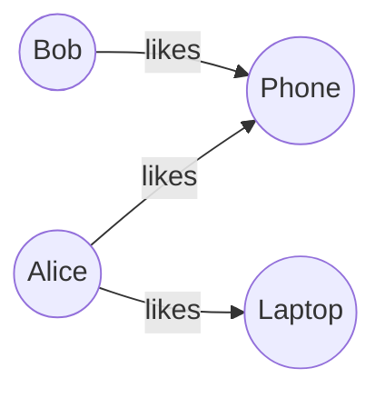

import { Aside, Steps, LinkCard, CardGrid } from '@astrojs/starlight/components';
import { User, Package, ArrowRight, ArrowLeft } from '@lucide/astro';

## Prerequisites

- Docker

## Start Actionbase

```bash
docker run -it --pull always ghcr.io/kakao/actionbase:standalone
```

This runs the server in the background and the CLI in the foreground.

```
    _        _   _             _
   / \   ___| |_(_) ___  _ __ | |__   __ _ ___  ___
  / _ \ / __| __| |/ _ \| '_ \| '_ \ / _` / __|/ _ \
 / ___ \ (__| |_| | (_) | | | | |_) | (_| \__ \  __/
/_/   \_\___|\__|_|\___/|_| |_|_.__/ \__,_|___/\___|

actionbase>
```

<Aside>
  The CLI is a thin wrapper around the REST API. Commands show the underlying HTTP requests, so you
  can see exactly what's happening.
</Aside>

## Write Data

Load sample data using a preset:

```
actionbase> load preset likes
```

This creates a `likes` database/table and inserts 3 edges:

```
  │ 3 edges inserted
  │  - Alice → Phone
  │  - Alice → Laptop
  │  - Bob → Phone
```



At write time, Actionbase **precomputes everything** for reads—counts, indexes, ordering for **both directions**. This means you can instantly query:

<div class="icon-rows">
  <div class="icon-row">
    "What did Alice like?" <User size={18} /> <ArrowRight size={18} /> <Package size={18} />{' '}
    (direction: OUT)
  </div>
  <div class="icon-row">
    "Who liked Phone?" <Package size={18} /> <ArrowLeft size={18} /> <User size={18} /> (direction:
    IN)
  </div>
</div>

No aggregation or JOINs at query time.

<details>
<summary>REST API equivalent</summary>

**Create service (database)**

```bash
curl -X POST "http://localhost:8080/graph/v2/service/likes" \
  -H "Content-Type: application/json" \
  -d '{"desc":"Likes"}'
```

**Create label (table)**

```bash
curl -X POST "http://localhost:8080/graph/v2/service/likes/label/likes" \
  -H "Content-Type: application/json" \
  -d '{
    "desc":"Like",
    "type":"INDEXED",
    "schema":{
      "src":{"type":"STRING"},
      "tgt":{"type":"STRING"},
      "fields":[{"name":"created_at","type":"LONG","nullable":false}]
    },
    "dirType":"BOTH",
    "storage":"datastore://likes/likes",
    "indices":[{"name":"created_at_desc","fields":[{"name":"created_at","order":"DESC"}]}]
  }'
```

**Insert edges**

```bash
curl -X POST "http://localhost:8080/graph/v3/databases/likes/tables/likes/edges" \
  -H "Content-Type: application/json" \
  -d '{
    "mutations":[
      {"type":"INSERT","edge":{"version":1737377177245,"source":"Alice","target":"Phone","properties":{"created_at":1737377177245}}},
      {"type":"INSERT","edge":{"version":1737377177297,"source":"Alice","target":"Laptop","properties":{"created_at":1737377177297}}},
      {"type":"INSERT","edge":{"version":1737377177350,"source":"Bob","target":"Phone","properties":{"created_at":1737377177350}}}
    ]
  }'
```

</details>

## Read Data

### Get

Check if a specific edge exists:

```
actionbase(likes:likes)> get --source Alice --target Phone
```

```
  │ The edge is found: [Alice -> Phone]
  │ |---------------|--------|--------|---------------------------|
  │ | VERSION       | SOURCE | TARGET | PROPERTIES                |
  │ |---------------|--------|--------|---------------------------|
  │ | 1737377177245 | Alice  | Phone  | created_at: 1737377177245 |
  │ |---------------|--------|--------|---------------------------|
```

<details>
<summary>REST API equivalent</summary>

```bash
curl "http://localhost:8080/graph/v3/databases/likes/tables/likes/edges/get?source=Alice&target=Phone"
```

</details>

### Scan

<div class="icon-row">
  <strong>What did Alice like?</strong> <User size={18} /> <ArrowRight size={18} />{' '}
  <Package size={18} /> (direction: OUT)
</div>

```
actionbase(likes:likes)> scan --index created_at_desc --start Alice --direction OUT
```

```
  │ The 2 edges found (offset: -, hasNext: false)
  │ |---|---------------|--------|--------|---------------------------|
  │ | # | VERSION       | SOURCE | TARGET | PROPERTIES                |
  │ |---|---------------|--------|--------|---------------------------|
  │ | 1 | 1737377177297 | Alice  | Laptop | created_at: 1737377177297 |
  │ | 2 | 1737377177245 | Alice  | Phone  | created_at: 1737377177245 |
  │ |---|---------------|--------|--------|---------------------------|
```

<div class="icon-row">
  <strong>Who liked Phone?</strong> <Package size={18} /> <ArrowLeft size={18} /> <User size={18} />{' '}
  (direction: IN)
</div>

```
actionbase(likes:likes)> scan --index created_at_desc --start Phone --direction IN
```

```
  │ The 2 edges found (offset: -, hasNext: false)
  │ |---|---------------|--------|--------|---------------------------|
  │ | # | VERSION       | SOURCE | TARGET | PROPERTIES                |
  │ |---|---------------|--------|--------|---------------------------|
  │ | 1 | 1737377177350 | Bob    | Phone  | created_at: 1737377177350 |
  │ | 2 | 1737377177245 | Alice  | Phone  | created_at: 1737377177245 |
  │ |---|---------------|--------|--------|---------------------------|
```

<Aside type="note">
  Both directions are precomputed at write time. No additional indexing or query overhead.
</Aside>

<details>
<summary>REST API equivalent</summary>

```bash
# OUT
curl "http://localhost:8080/graph/v3/databases/likes/tables/likes/edges/scan/created_at_desc?start=Alice&direction=OUT"

# IN
curl "http://localhost:8080/graph/v3/databases/likes/tables/likes/edges/scan/created_at_desc?start=Phone&direction=IN"
```

</details>

### Count

<div class="icon-row">
  <strong>How many items did Alice like?</strong> <User size={18} /> <ArrowRight size={18} />{' '}
  <Package size={18} /> (direction: OUT)
</div>

```
actionbase(likes:likes)> count --start Alice --direction OUT
```

```
  │ |-------|-----------|-------|
  │ | START | DIRECTION | COUNT |
  │ |-------|-----------|-------|
  │ | Alice | OUT       | 2     |
  │ |-------|-----------|-------|
```

<div class="icon-row">
  <strong>How many users liked Phone?</strong> <Package size={18} /> <ArrowLeft size={18} />{' '}
  <User size={18} /> (direction: IN)
</div>

```
actionbase(likes:likes)> count --start Phone --direction IN
```

```
  │ |-------|-----------|-------|
  │ | START | DIRECTION | COUNT |
  │ |-------|-----------|-------|
  │ | Phone | IN        | 2     |
  │ |-------|-----------|-------|
```

<Aside type="note">Counts are precomputed at write time. No aggregation needed.</Aside>

<details>
<summary>REST API equivalent</summary>

```bash
# OUT
curl "http://localhost:8080/graph/v3/databases/likes/tables/likes/edges/count?start=Alice&direction=OUT"

# IN
curl "http://localhost:8080/graph/v3/databases/likes/tables/likes/edges/count?start=Phone&direction=IN"
```

</details>

## Next Steps

<CardGrid>
  <LinkCard title="CLI Reference" href="/operations/cli/" description="Full CLI documentation" />
  <LinkCard
    title="Build Your Social Media App"
    href="/guides/build-your-social-media-app/"
    description="Hands-on guide"
  />
  <LinkCard title="Core Concepts" href="/design/concepts/" description="How Actionbase works" />
</CardGrid>
