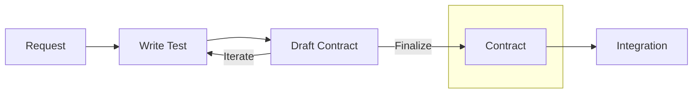
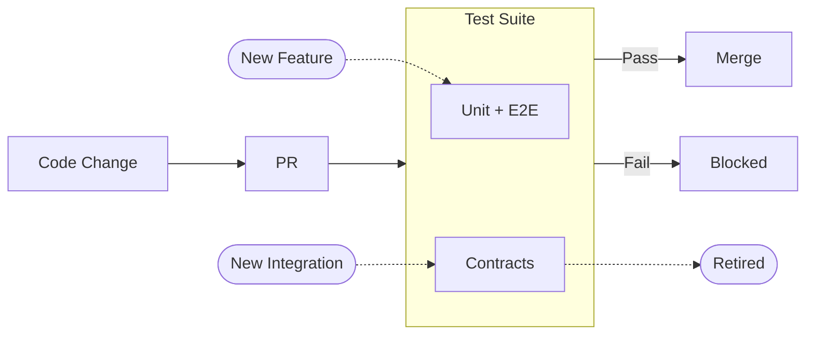

This story demonstrates the **Tests as Contracts** pattern: how Actionbase evolved continuously without ever breaking existing integrations.

## What Is Tests as Contracts?

**Test = Spec = Doc = Guard.** One source of truth.

When a service team integrates with Actionbase, we don't write documentation. We write a scenario test together. That test:

- Defines the contract (schema, mutations, queries)
- Generates documentation automatically
- Runs on every PR to guard production

If the test passes, the promise holds. If it fails, the change is blocked. What we promise, we guarantee—100%.

## Why We Needed This

Actionbase isn't an API server—it's a database with a REST interface. Services rely on specific behaviors: pagination size, index filters, query direction, batch semantics, consistency guarantees. Combine these, and the number of possible usage patterns explodes.

We have unit tests. We have E2E tests. We do our best. But even with all that, we couldn't be 100% certain that every promised usage pattern would keep working. Contract tests fill that gap—they guarantee exactly what we promise.

## How It Works

### 1. Integration: Tests Become Contracts



When a service team wants to integrate with Actionbase, the process starts with a concrete request:

"We need the 10 most recent wishes for a user, sorted by timestamp descending."

Instead of writing documentation, we write a scenario test together. That test defines:

- The schema (edges, properties, indexes)
- The mutations (create, update, delete)
- The queries (exact access patterns, limits, ordering)

This test is not an example. It is the contract.

From that test, documentation is generated automatically. CI extracts schema definitions, API examples, and query semantics from the test, then deploys them to our documentation site. The service team reviews. We iterate. We adjust the test. Writing the test is manual. Everything after that is automated.

Once everyone agrees, the contract is locked. At that moment, the test stops being just a test. It becomes a promise.

We write the tests ourselves. Not because we want to, but because we have to. If a contract breaks, we're the ones who get paged. Owning the tests means owning the risk. This worked for survival. But as we open-source Actionbase, we're exploring a new model—one where anyone can contribute contracts. What that looks like is still evolving.

### 2. Protection: Locked Contracts Guard Production



Locked contracts never disappear. Every pull request runs unit tests, E2E tests, and all locked contracts.

- **Unit tests** — verify internal correctness
- **E2E tests** — verify the system works (written by us)
- **Contract tests** — verify promises to each service (written together)

If everything passes, the change ships. If even one contract fails, the PR cannot be merged. No exceptions. We don't ask: "Is this change reasonable?" We ask: "Does this break anything we promised?"

## Living with Contracts

### Same Table, Different Contracts

One table can have many contracts—because the same data is used in different ways. One service needs 100 items at once. Another paginates 10 at a time. One needs strong consistency. Another is fine with eventual consistency.

Each usage pattern is a separate contract. Each is protected independently.

### Changing Contracts

Contracts can be changed. But not in place.

To modify a contract safely: create a new contract, migrate the service, then remove the old one. This ensures no integration breaks during the transition.

## Comparison

| Aspect             | Pact-style                   | Actionbase                           |
| ------------------ | ---------------------------- | ------------------------------------ |
| **Contract Scope** | API shape (request/response) | Usage patterns                       |
| **Documentation**  | Separate, can drift          | Generated from tests, always current |
| **Evolution**      | Version negotiation          | Cumulative, forever                  |
| **Failure**        | Consumer incompatibility     | Broken promise → blocked             |

## What We Learned

- **Contracts are promises, not documents.** Every integration is a promise. Tests enforce that promise on every PR.
- **Evolving systems need guardrails.** Actionbase was never finished—new features, new optimizations, new storage backends. But every change was safe because every promise was tested.
- **Trust comes from guarantees, not goodwill.** Service teams stopped asking "will this break us?" They knew: if the contract passes, they're safe.

## Appendix: Contract Test Structure

The following is a simplified pseudo-code example showing how contract tests are structured. The actual implementation differs in details, but the core concept remains the same.

```kotlin
@Contract(
    service = "gift",
    feature = "wish",
    outputDir = "services/gift/wish",  // generated docs go here
)
class WishContract {
    val context = Context.from(WishTable)

    // inner class -> .mdx file
    // test method -> section in the file

    inner class Schema : SchemaSpec(context) {      // -> schema.mdx
        @Spec fun schema() = defineSchema()         //    ## Schema
        @Spec fun sampleData() = createSampleData() //    ## Sample Data
    }

    inner class Operations : OperationSpec(context) { // -> operations.mdx
        @Spec fun createDatabase() = ddl.createDatabase()
        @Spec fun createTable() = ddl.createTable()
    }

    inner class Integration : IntegrationSpec(context) { // -> integration.mdx
        @Spec(title = "Insert edge")  // ## Insert edge
        fun insert() {
            mutate(edge, INSERT)
        }

        @Spec(title = "Get edge")     // ## Get edge
        fun get() {
            val result = get(source = "user-123", target = "product-456")
            assertEquals(1, result.count)
        }

        @Spec(title = "Scan edges")   // ## Scan edges
        fun scan() {
            val result = scan(source = "user-123", direction = OUT, limit = 10)
            assertSortedByTimestampDesc(result)
        }

        @Spec(title = "Count edges")  // ## Count edges
        fun count() {
            val result = count(source = "user-123", direction = OUT)
            assertEquals(5, result.value)
        }
    }
}
```

The test framework is built on JUnit extensions. Each inner class generates an `.mdx` file, and each test method becomes a section within that file. The tooling used internally is planned for open-source release. See the [Roadmap](/community/roadmap/) for details.
