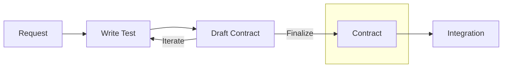
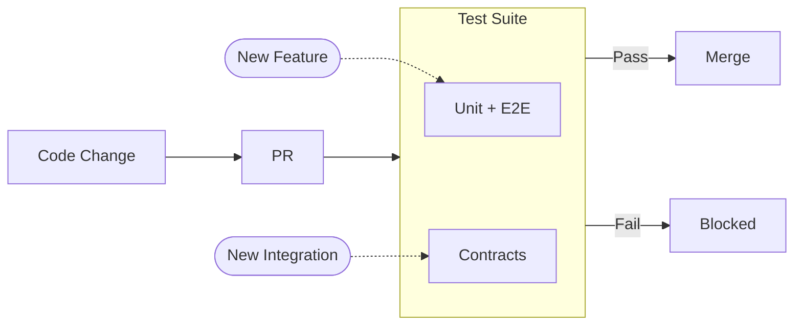

This story demonstrates the **Tests as Contracts** pattern: how Actionbase evolved continuously while preserving promised behaviors.

## What Is Tests as Contracts?

**Test = Spec = Doc = Guard.** One source of truth.

When a service team integrates with Actionbase, we avoid manual documentation. Instead, we co-author a scenario test. That test:

- Defines the contract (schema, mutations, queries)
- Generates documentation automatically
- Runs on every PR to gate changes before production

If the test passes, the promise holds. If it fails, the change is blocked.

## Why We Needed This

Services rely on specific behaviors: pagination size, index filters, query direction, batch semantics, consistency guarantees. One team depends on descending timestamp order. Another expects exactly 100 items per batch. Combine these, and the number of possible usage patterns explodes.

We have unit tests. We have E2E tests. We do our best. But even with all that, we couldn't be 100% certain that every promised usage pattern would keep working. We needed a way to evolve continuously without breaking existing integrations. Contract tests fill that gap—they guarantee exactly what we promise.

## How It Works

### 1. Integration: Tests Become Contracts



When a service team wants to integrate with Actionbase, the process starts with a concrete request:

"We need the 10 most recent wishes for a user, sorted by timestamp descending."

Instead of writing documentation, we write a scenario test together. That test defines:

- The schema (edges, properties, indexes)
- The mutations (create, update, delete)
- The queries (exact access patterns, limits, ordering)

This test is not an example. It is the contract.

From that test, documentation is generated automatically. When tests run, they generate schema definitions, API examples, and query semantics as `.mdx` files—then CI deploys them to our documentation site. The service team reviews. We iterate. We adjust the test. Writing the test is manual. Everything after that is automated.

Once everyone agrees, the contract is locked—both sides must approve any changes or retirement. At that moment, the test stops being just a test. It becomes a promise.

The contracts we write cover the usage patterns that services depend on. Writing these contracts takes more work, but it's a choice we made—for trust.

### 2. Protection: Locked Contracts Guard Production



Locked contracts stay until both sides agree—whether to evolve or retire. Every pull request runs unit tests, E2E tests, and all locked contracts.

- **Unit + E2E tests** — when adding new features
- **Contract tests** — when adding new integrations

If everything passes, the change ships. If even one contract fails, the PR cannot be merged—for everything we explicitly promised. We don't ask: "Is this change reasonable?" We ask: "Does this break anything we promised?"

## Living with Contracts

### Same Table, Different Contracts

One table can have many contracts. Service A fetches 100 items at once for batch export. Service B paginates 10 at a time for mobile UI. Service C requires strong consistency for real-time counters, while Service D tolerates eventual consistency for analytics. Each usage pattern is a separate contract, protected independently.

### Evolving Contracts

Contracts evolve with service requirements. Each change increments the version—old versions remain until services migrate.

## How We Differ from Traditional Contract Testing

Traditional contract testing (like Pact) focuses on API shape—request and response formats. Our contracts go deeper: they capture usage patterns, not just interfaces.

|                | Traditional           | Actionbase             |
| -------------- | --------------------- | ---------------------- |
| **Scope**      | API shape             | Usage patterns         |
| **Docs**       | Separate              | Generated from tests   |
| **Guarantees** | Payload compatibility | Behavior compatibility |

## What We Learned

- **Contracts are promises, not documents.** Every integration is a promise. Tests enforce that promise on every PR.
- **Evolving systems need guardrails.** Actionbase was never finished—new features, new optimizations, new storage backends. But every change was safe because every promise was tested.
- **Trust comes from guarantees, not goodwill.** Service teams stopped asking "will this break us?" They knew: if the contract passes, they're safe.

## Appendix: Contract Test Structure

The following is a simplified pseudo-code example showing how contract tests are structured. The actual implementation differs in details, but the core concept remains the same.

```kotlin
@Contract(
    service = "gift",
    feature = "wish",
    outputDir = "services/gift/wish",  // generated docs go here
)
class WishContract {
    val context = Context.from(WishTable)

    // inner class -> .mdx file
    // test method -> section in the file

    inner class Schema : SchemaSpec(context) {      // -> schema.mdx
        @Spec fun schema() = defineSchema()         //    ## Schema
        @Spec fun sampleData() = createSampleData() //    ## Sample Data
    }

    inner class Operations : OperationSpec(context) { // -> operations.mdx
        @Spec fun createDatabase() = ddl.createDatabase()
        @Spec fun createTable() = ddl.createTable()
    }

    inner class Integration : IntegrationSpec(context) { // -> integration.mdx
        @Spec(title = "Insert edge")  // ## Insert edge
        fun insert() {
            mutate(edge, INSERT)
        }

        @Spec(title = "Get edge")     // ## Get edge
        fun get() {
            val result = get(source = "user-123", target = "product-456")
            assertEquals(1, result.count)
        }

        @Spec(title = "Scan edges")   // ## Scan edges
        fun scan() {
            val result = scan(source = "user-123", direction = OUT, limit = 10)
            assertSortedByTimestampDesc(result)
        }

        @Spec(title = "Count edges")  // ## Count edges
        fun count() {
            val result = count(source = "user-123", direction = OUT)
            assertEquals(5, result.value)
        }
    }
}
```

The test framework is built on JUnit extensions. Each inner class generates an `.mdx` file, and each test method becomes a section within that file.

The contract testing framework isn't included in the current release—it contains internal details we're still sanitizing. We plan to open-source it incrementally, and we're exploring a model where anyone can contribute contracts. In the meantime, we'll share what we can through talks and presentations. See the [Roadmap](/community/roadmap/) for updates.
