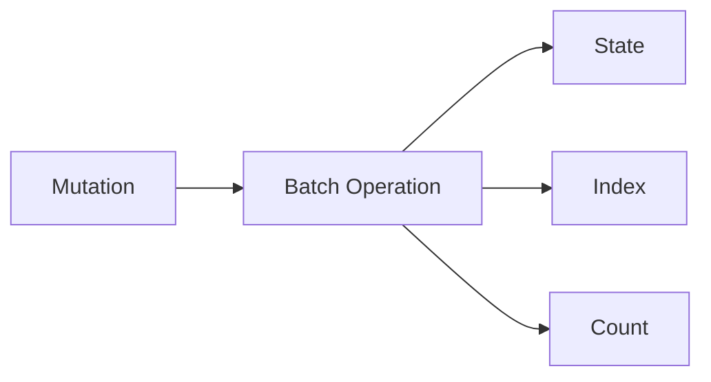
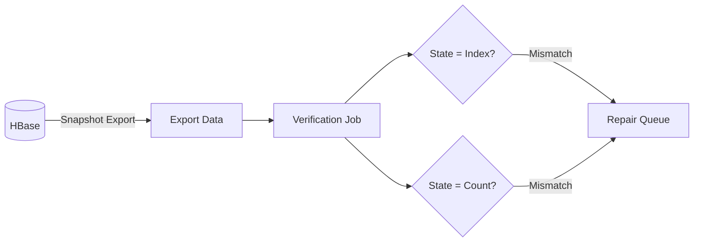

This story demonstrates the **Periodic Verification** pattern: how to detect and correct data inconsistencies that can occur during operations.

## Why We Needed This {#why-we-needed-this}

Deployed. Migration verified. But data inconsistencies can still occur during operations. There's no perfect atomicity in distributed systems.

## Data Structure {#data-structure}

Actionbase stores three types of data in HBase:

- **State**: Source of truth - actual edge records
- **Index**: Derived data for queries
- **Count**: Aggregated data

A single mutation updates State, Index, and Count together.

## Consistency Problem {#consistency-problem}

HBase batch operations are not atomic. If a region server fails mid-operation or network issues cause partial writes, only some may update.

If State updated but Index didn't? Queries return wrong results.

## How It Works {#how-it-works}

Verify periodically.

Export HBase snapshots and run verification jobs:

- **State vs Index**: Does every state have a corresponding index?
- **State vs Count**: Does the aggregation match actual record count?

## Correction {#correction}

When mismatch is detected, we correct it. State is the truth. Index and Count can be regenerated from State.

Correction frequency is determined by service SLA.

## What We Learned {#what-we-learned}

- **Don't expect perfect atomicity.** Partial failures happen in distributed systems. Mechanisms to detect and correct them are necessary.
- **State is the truth.** Design derived data (Index, Count) so it can always be regenerated from State.
