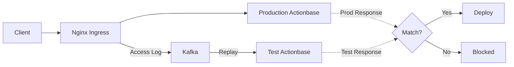
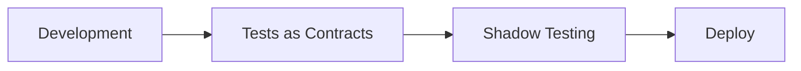

This story demonstrates the **Shadow Testing** pattern: how to perform final verification before deployment by mirroring production traffic.

## Why We Needed This {#why-we-needed-this}

[Tests as Contracts](/stories/how-we-survived/contracts/) passed. But there are areas tests can't cover:

- Bugs that only occur with specific data combinations
- Performance issues dependent on traffic patterns
- Issues that only surface at production data scale
- Clients using behaviors not specified in contracts

These are conditions you can't create in test environments.

## How It Works {#how-it-works}

Nginx Ingress in front of production Actionbase logs all requests and responses as Access Logs. These logs go to Kafka, and the same requests are replayed to the test environment. Since it's log-based, there's no impact on live service traffic.

1. **Capture**: Nginx Ingress logs requests and responses to Kafka as Access Logs
2. **Replay**: Same requests replayed to test environment
3. **Compare**: Compare production response with test response
4. **Gate**: Block deployment on mismatch

## Deployment Process {#deployment-process}

Both stages must pass before deployment proceeds.

## What We Learned {#what-we-learned}

- **Real traffic is irreplaceable.** No matter how sophisticated test scenarios are, they can't perfectly reproduce production traffic patterns.
- **Final gate before deployment.** Both Tests as Contracts and Shadow Testing must pass before deployment.
