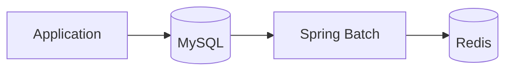
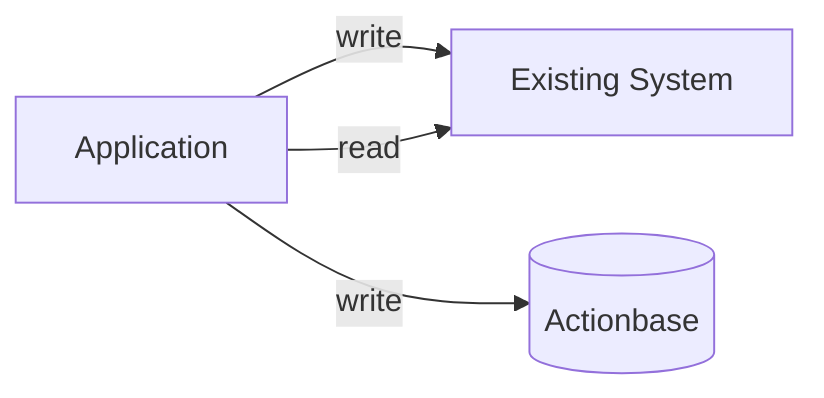
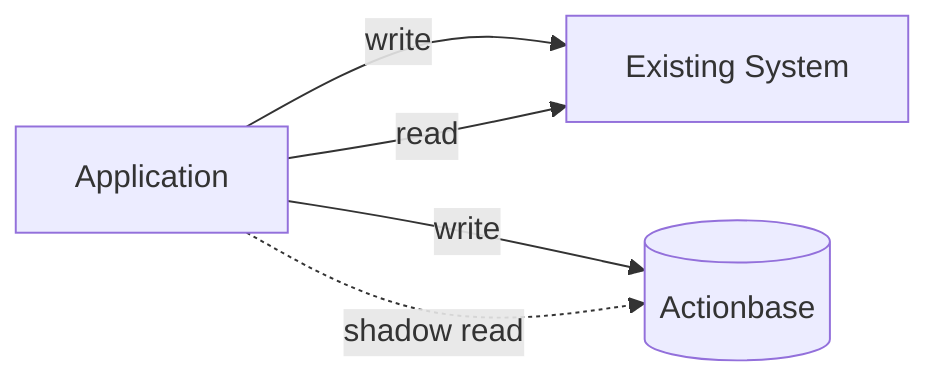
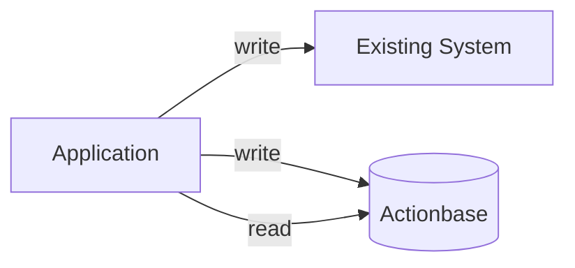
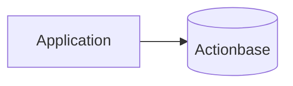

> **SSOT (Single Source of Truth)**: Actionbase owns the data. Replace your existing storage with Actionbase as the primary system.

This is the story of how KakaoTalk Gift's wish list became Actionbase's first production deployment.

## The Challenge

The wish list feature in KakaoTalk Gift allowed users to save gifts they wanted to receive. The existing architecture looked like this:

- **MySQL** stored the wish data and served forward queries (get, scan, count by user)
- **Spring Batch** aggregated reverse counts (how many users wished each product)
- **Redis** cached the reverse counts for fast reads

This worked well initially. But as traffic grew, we hit scaling walls:

- Table size grew beyond comfortable limits
- Keeping data consistent between MySQL and Redis became complex

We considered sharding MySQL. But sharding brings its own complexity—shard key management, cross-shard queries, operational overhead. Actionbase got the chance to prove itself here.

## Migration Strategy

We didn't flip a switch. The migration happened in careful stages over several months.

### Stage 1: Dual Write

First, we added Actionbase as a write target alongside the existing system (MySQL + Redis). Reads still came from the existing system.

For historical data, we:

1. Dumped the MySQL table
2. Bulk-loaded into Actionbase
3. Replayed the WAL to catch up with writes that happened during the dump

> **Note:** The migration pipeline (bulk loading) is currently internal. Open source release is in progress. See [Roadmap](/community/roadmap/).

This gave us a consistent snapshot without downtime.

### Stage 2: Validation

For one month, we compared:

- MySQL dumps (source of truth)
- Actionbase CDC-based snapshots

The data matched. We had confidence in consistency.

### Stage 3: Dual Read

Next, we added shadow reads to Actionbase—calling it but not using the results. This validated that Actionbase could handle production traffic patterns without affecting users.

### Stage 4: Read Cutover

After confirming traffic handling, we switched reads to Actionbase. At this point, Actionbase became the source of truth. The existing system remained as a backup—if anything went wrong, we could roll back instantly.

### Stage 5: Cleanup

Months later, with no issues, we removed the old system entirely:

No more batch jobs. No more consistency issues. Just Actionbase.

## What We Learned

- **Gradual migration reduces risk.** Dual write, then dual read, then cutover. Each stage validates the next.
- **Keep rollback paths open.** We maintained the existing system for months after the cutover. Peace of mind matters.
- **WAL replay enables zero-downtime bulk loads.** Dump, load, replay—no data loss.

This pattern became the template for source-of-truth migrations at Kakao.
