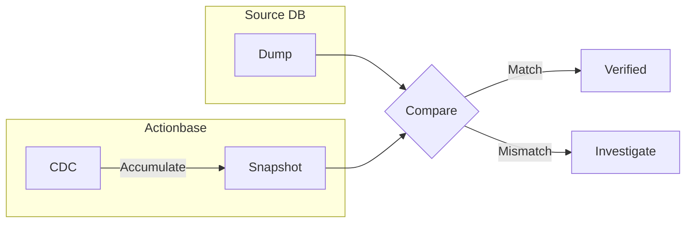

This story demonstrates the **Comparison Verification** pattern: how to verify data integrity when migrating data from existing systems to Actionbase.

## Why We Needed This {#why-we-needed-this}

Migrating data from existing systems to Actionbase. How can we be confident the data was transferred correctly?

We didn't migrate all data at once. For [KakaoTalk Gift Wish](/stories/kakaotalk-gift-wish/), we went through 5 stages. Verify at each stage, then proceed to the next.

## How It Works {#how-it-works}



We compare two data sources:

1. **Source DB Dump**: Direct export from source database
2. **Actionbase CDC Snapshot**: Accumulated "after" values from Actionbase CDC

If they match, proceed to the next stage. If mismatch, stop and investigate.

## Boundary Handling {#boundary-handling}

Source DB Dump and CDC Snapshot timestamps don't align exactly. Boundary data exists.

Boundary data is excluded from the current verification window. If the verification window is `T-1` day 00:00 ~ 23:59, boundary data is verified in the next window `T`. As the window slides, all data gets verified.

## Why CDC Snapshot {#why-cdc-snapshot}

We could read HBase directly and compare. But CDC Snapshot is data created through an independent path.

```
Source DB → Actionbase → HBase → CDC → Snapshot
```

This entire pipeline must work correctly for them to match. If something goes wrong anywhere in the pipeline, mismatch occurs.

## What We Learned {#what-we-learned}

- **Verify with independent sources.** Create the same data through different paths and compare. If they match, the entire pipeline is working.
- **Progress in stages.** Don't migrate all data at once. Verify at each stage before proceeding.
