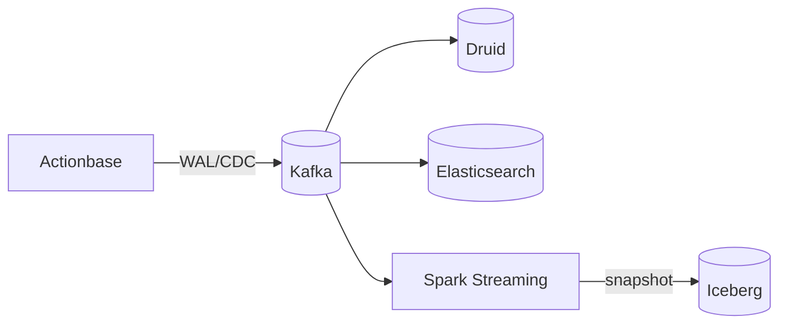

> This story shares how Kakao uses Actionbase internally. We're preparing to open source these components — see [Roadmap](/community/roadmap/).

This story demonstrates the **Integration Pipeline** pattern: how Actionbase satisfies downstream requirements without building them itself.

## The Challenge

Actionbase is optimized for OLTP—fast reads and writes for user-facing interactions. But teams need more:

- Analytics and dashboards
- Fraud detection
- ML training data
- Operations (CS, disaster recovery)

Building these into Actionbase would compromise its core mission. But ignoring them isn't an option either.

## The Strategy

The answer: delegation through event streaming.

Every mutation in Actionbase produces WAL and CDC events. By publishing these to Kafka, Actionbase delegates downstream requirements to specialized systems—while staying focused on what it does best.

### WAL/CDC to Kafka

Actionbase publishes events to Kafka at two points:

- WAL: Mutation request as-is—replay to rebuild state (idempotent)
- CDC: Stored result after processing—accumulate for current snapshot

See [Mutation](/design/mutation/) for the full flow.

### Analytics Backends

Different backends serve different needs:

- Spark Streaming: Complex event processing, periodic batch jobs
- Druid: Real-time aggregations, dashboards
- Elasticsearch: Real-time log search, event-by-event lookup (WAL/CDC)
- OLAP engines (Presto, Hive, etc.): Ad-hoc queries on large datasets

### Snapshots

Originally, Spark Streaming dumped Kafka periodically, and Spark Batch created snapshots. Recently migrating to Iceberg for more efficient storage.

## What This Enables

By publishing WAL/CDC, Actionbase doesn't implement these—but makes them possible:

CDC consumers (current state):

- Analytics: OLAP queries, dashboards, insight extraction
- Fraud detection: Abuse patterns, anomaly detection
- ML: Training data for recommendations
- Customer support: All mutations stored in Elasticsearch for short-term CS queries

WAL consumers (replay):

- Async processing: [Recent Views](/stories/kakaotalk-gift-recent-views/) consumes WAL and sends mutations back
- Operations: Data migration, disaster recovery, consistency checks

Actionbase focuses on OLTP. The requirements are still met—through delegation.

## What We Learned

- Do one thing well. Actionbase handles OLTP; specialized systems handle the rest.
- Events are the integration layer. WAL/CDC to Kafka decouples producers from consumers.
- Delegation satisfies requirements. You don't have to build everything yourself.

This pattern lets Actionbase stay focused while enabling capabilities far beyond its core.
