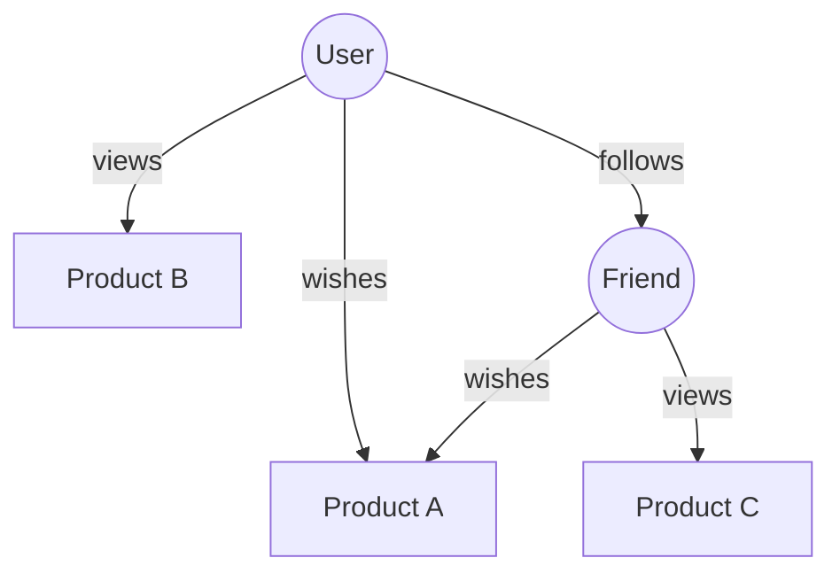

This is the story of where Actionbase is heading—and the problem we're solving.

## The Pattern

Consider the stories so far:

- **Wish** — users saving gifts they want to receive
- **Recent Views** — users browsing products
- **Friends** — users connecting with users

Each started as an isolated feature. Different teams, different tables, different scaling strategies. But from a data modeling perspective, they share the same structure:

**Who** did **what** to which **target**.

## The Convergence

As more features adopt Actionbase, a structure emerges:



Individual edges accumulate. What was once scattered across databases becomes a connected graph:

- Products connect around users
- Users connect with users
- The flow of the entire service becomes visible

## The Problem

Today, each feature queries its own slice:

- "What did I wish for?"
- "What did I view recently?"
- "Who do I follow?"

But what about: **"What did my friends wish for?"**

This query spans two features — Friends and Wish. It requires traversing the graph: get my friends, then get each friend's wishes. Currently, no system serves this efficiently at scale. This is the problem we're solving — and has been [our vision from the beginning](/blog/open-source-announcement/):

> When your data converges in Actionbase, you may discover possibilities you couldn't see before.

"What did my friends wish for?" is one such possibility.

## Where We Are

In 2026, we're preparing to make it real. With each adoption, the structure grows. With each edge, the graph becomes richer.

See [Roadmap](https://github.com/kakao/actionbase/blob/main/ROADMAP.md) for details.

## Technical Notes

### `EdgeIndex`: Narrow Rows

Actionbase uses `EdgeIndex`, a narrow row structure optimized for Scan. Why not wide rows from the start? Because narrow rows scale simply — if you need more capacity, add nodes.

```
Row Key: salt | source | tableCode | direction | indexCode | indexValues | target
Qualifier: "e" (fixed)
Value: version | properties
```

Each edge is one row. Single-hop queries ("What did I wish for?") work well — one Scan by source prefix retrieves all edges.

### `EdgeCache`: Wide Rows (Planned)

Why are multi-hop queries hard? With narrow rows, "What did my friends wish for?" requires: get my N friends, then N Scans to get each friend's wishes. N RPCs don't scale.

Wide rows solve this:

```
Row Key: salt | source | tableCode | direction | indexCode
Qualifier: indexValues | target
Value: version | properties
```

With wide rows, all edges for one source fit in a single row as separate columns. Fetching edges for N friends becomes a single MultiGet (1 RPC to storage backend, currently HBase) instead of N Scans (N RPCs to storage backend).

### Why Both?

Different roles:

- `EdgeIndex` — maintains all edges. Narrow rows scale simply. Add nodes, done.
- `EdgeCache` — keeps only top N edges for multi-hop efficiency.

But wide rows can grow unbounded. A user with millions of edges creates a massive row. A **Pruner** solves this by:

- Consuming CDC to detect changes
- Keeping only top N edges per row (by index order)
- Multi-hop queries only need top N anyway

### What This Means

- **Query Layer**: Add multi-hop API with bounded traversal depth
- **Storage Layer**: Add `EdgeCache` alongside `EdgeIndex`
- **Pruner**: Background process to maintain `EdgeCache` size via CDC
- **Migration**: Bulk-load `EdgeCache` from existing data

Both structures will coexist — `EdgeIndex` as the complete index, `EdgeCache` for multi-hop efficiency.
