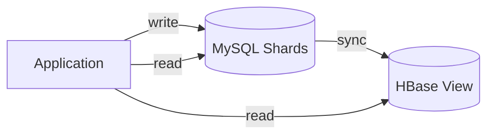
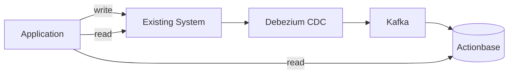

This story demonstrates the **CQRS (Command Query Responsibility Segregation)** pattern: how Actionbase became a read-optimized view layer for KakaoTalk's friend relationships.

## The Challenge

Friend relationships in KakaoTalk are stored across dozens of sharded MySQL databases. To serve read-heavy queries, an HBase-based view layer was already in place:

This worked for the original use case. But as requirements evolved, limitations emerged:

- The HBase view was designed for a specific access pattern
- Limited flexibility for new query types and schema changes

We added Actionbase—not as a replacement, but as an additional view layer.

## Integration Strategy

Rather than replacing the existing system, we added Actionbase alongside it:

The key insight: Actionbase doesn't need to be the source of truth. It can serve as a flexible view, consuming changes via CDC. The existing system (MySQL + HBase) remained unchanged.

### Stage 1: CDC Pipeline

First, we set up the data flow. Debezium captured changes from MySQL shards and published them to Kafka. Actionbase consumed these events and applied mutations.

### Stage 2: Bulk Load

For historical data, we:

1. Dumped the MySQL tables
2. Bulk-loaded into Actionbase
3. Replayed the WAL to catch up with changes during the dump

> **Note:** The migration pipeline (bulk loading) is currently internal. Open source release is in progress — see [Roadmap](https://github.com/kakao/actionbase/blob/main/ROADMAP.md).

This gave us a consistent snapshot without downtime.

### Stage 3: New Query Layer

With Actionbase in place, new systems used it for all query types—get, scan, count, and reverse—through a single schema definition.

## What We Learned

- **Actionbase works as a CQRS view.** It doesn't have to own the data to add value.
- **Source DB CDC enables non-invasive integration.** No changes to the write path required.
- **Schema flexibility unlocks new use cases.** Get, scan, count, reverse—all from a single schema definition.

This pattern opened the door to adding Actionbase alongside existing systems without migration risk.
