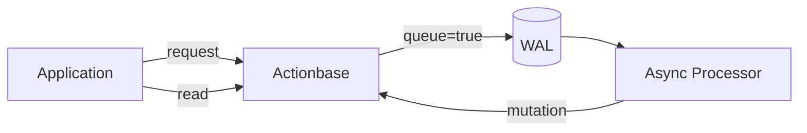

This story demonstrates the **Asynchronous Processing** pattern: how Actionbase handled high-frequency writes for KakaoTalk Gift's recent views.

## The Challenge

Recent views are different from other interactions. Every time a user browses a product, a view event is generated. The write volume is significantly higher than likes or wishes.

Processing these writes synchronously in the user-facing request path would:

- Increase response latency
- Create backpressure during traffic spikes
- Risk service degradation under load

Actionbase needed a pattern that could absorb high write throughput without affecting user experience.

## Async Strategy

Rather than processing mutations synchronously, we used async processing:

The key insight: separate the acknowledgment from the processing. The user gets an immediate response while the actual mutation happens in the background.

### Stage 1: Queue to WAL

First, when a view event arrives, Actionbase writes it to WAL with `queue=true` and returns immediately. No locking, no state computation—just append to the log.

### Stage 2: Processing

Next, a Spark Streaming job consumes the WAL entries and sends mutations back to Actionbase. The processor:

- Batches events for efficiency
- Throttles during traffic spikes
- Retries on transient failures

> **Note:** The async processor is currently internal. Open source release is in progress — see [Roadmap](https://github.com/kakao/actionbase/blob/main/ROADMAP.md).

### Stage 3: Background Mutation

Finally, Actionbase processes the mutations in the background—acquiring locks, updating state, computing indexes and counts. Data is typically reflected within tens of milliseconds.

## What We Learned

- **Async processing handles write spikes gracefully.** The WAL absorbs bursts; the processor drains at a sustainable rate.
- **Immediate response improves user experience.** Users don't wait for the full mutation cycle.
- **Eventual consistency is acceptable for some use cases.** Recent views don't need real-time accuracy—tens of milliseconds delay is fine.

This pattern became the template for high-frequency interactions at Kakao.
